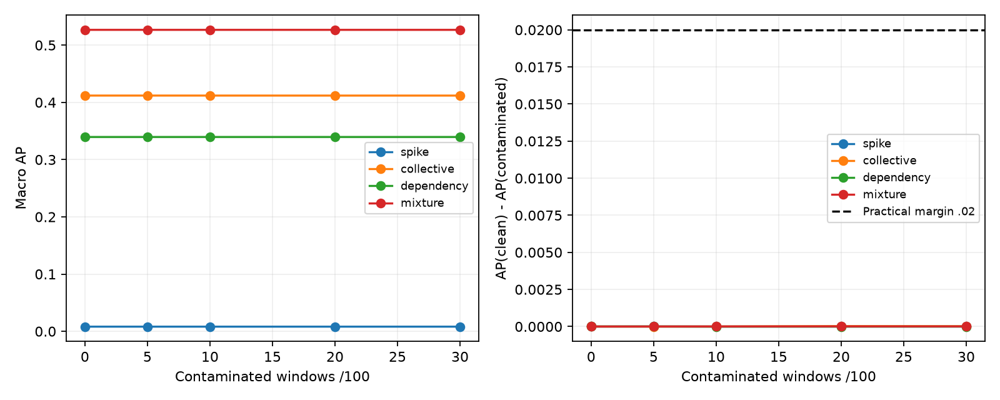

# Phase D v2 controlled H1 decision

D0 **PASS**. **H1-HARM STOP** under the unchanged frozen decision rule.

All four pre-grid gates and all 12 canaries passed bitwise. The complete 4,800-row grid is new; zero quarantined v1 rows entered estimation, plots, CIs, tests or decisions. The five sealed backbones were reused without retraining. Correction: restore accepted execution backend state, including cuDNN deterministic=True; deterministic_algorithms remains False.

## All comparisons, including negative/null and stress results

| Type | c% | AP(clean) − AP(c) | Paired 95% CI | Holm p (22) | Positive seeds/scenarios | GO |
|---|---:|---:|---|---:|---|---|
| spike | 5 | -0.000001 | [-0.000003, 0.000000] | 0.927734 | 0/5; 0/4 | False |
| spike | 10 | -0.000000 | [-0.000002, 0.000001] | 1.000000 | 1/5; 2/4 | False |
| spike | 20 | -0.000001 | [-0.000004, 0.000003] | 1.000000 | 2/5; 3/4 | False |
| spike | 30 | -0.000001 | [-0.000005, 0.000002] | 1.000000 | 3/5; 2/4 | False |
| collective | 5 | -0.000005 | [-0.000008, -0.000002] | 0.164062 | 0/5; 0/4 | False |
| collective | 10 | 0.000003 | [-0.000001, 0.000007] | 1.000000 | 4/5; 3/4 | False |
| collective | 20 | 0.000028 | [0.000017, 0.000040] | 0.042969 | 5/5; 3/4 | False |
| collective | 30 | 0.000021 | [-0.000000, 0.000043] | 1.000000 | 5/5; 3/4 | False |
| dependency | 5 | 0.000003 | [-0.000000, 0.000007] | 1.000000 | 5/5; 4/4 | False |
| dependency | 10 | -0.000008 | [-0.000015, 0.000001] | 1.000000 | 1/5; 2/4 | False |
| dependency | 20 | -0.000006 | [-0.000019, 0.000006] | 1.000000 | 2/5; 2/4 | False |
| dependency | 30 | -0.000002 | [-0.000036, 0.000030] | 1.000000 | 3/5; 2/4 | False |
| mixture | 5 | 0.000004 | [0.000001, 0.000007] | 0.820312 | 5/5; 3/4 | False |
| mixture | 10 | 0.000004 | [0.000000, 0.000007] | 0.949219 | 5/5; 3/4 | False |
| mixture | 20 | 0.000009 | [-0.000001, 0.000020] | 1.000000 | 3/5; 3/4 | False |
| mixture | 30 | 0.000008 | [-0.000013, 0.000038] | 1.000000 | 2/5; 3/4 | False |

c30 is stress-only and cannot qualify. No natural-SMD harm alternative was run (six p=1 placeholders). Hierarchical bootstrap: 10,000 draws, seed901; exact two-sided source-cluster sign flips; 10 sources first, five paired detector seeds second, all four scenarios kept jointly.

## All contamination curves and no-update controls

| Type | c% / control | Macro AP | Macro AUROC | Fixed FPR | Fixed recall |
|---|---|---:|---:|---:|---:|
| spike | no update | 0.008074 | 0.583203 | 0.501564 | 0.521125 |
| spike | 0 | 0.008142 | 0.582641 | 0.492178 | 0.510625 |
| spike | 5 | 0.008143 | 0.582640 | 0.492166 | 0.510750 |
| spike | 10 | 0.008142 | 0.582629 | 0.492150 | 0.510750 |
| spike | 20 | 0.008142 | 0.582620 | 0.492139 | 0.510750 |
| spike | 30 | 0.008143 | 0.582612 | 0.492132 | 0.510750 |
| collective | no update | 0.410924 | 0.787604 | 0.502915 | 0.753948 |
| collective | 0 | 0.411916 | 0.788429 | 0.493511 | 0.746302 |
| collective | 5 | 0.411921 | 0.788427 | 0.493499 | 0.746296 |
| collective | 10 | 0.411913 | 0.788429 | 0.493484 | 0.746254 |
| collective | 20 | 0.411888 | 0.788428 | 0.493432 | 0.746196 |
| collective | 30 | 0.411895 | 0.788438 | 0.493378 | 0.746190 |
| dependency | no update | 0.337488 | 0.712872 | 0.501653 | 0.644113 |
| dependency | 0 | 0.339534 | 0.713802 | 0.492156 | 0.635770 |
| dependency | 5 | 0.339531 | 0.713802 | 0.492167 | 0.635781 |
| dependency | 10 | 0.339542 | 0.713811 | 0.492186 | 0.635776 |
| dependency | 20 | 0.339540 | 0.713810 | 0.492237 | 0.635765 |
| dependency | 30 | 0.339536 | 0.713815 | 0.492252 | 0.635765 |
| mixture | no update | 0.525274 | 0.746664 | 0.503274 | 0.695328 |
| mixture | 0 | 0.526762 | 0.747518 | 0.493791 | 0.687281 |
| mixture | 5 | 0.526757 | 0.747514 | 0.493781 | 0.687263 |
| mixture | 10 | 0.526758 | 0.747515 | 0.493786 | 0.687248 |
| mixture | 20 | 0.526753 | 0.747523 | 0.493769 | 0.687240 |
| mixture | 30 | 0.526753 | 0.747539 | 0.493797 | 0.687232 |

## Interpretation and limits

H1-admission remains GO from independent C3 evidence; admission is not harm. This test compares one clean versus contaminated pinned SANA update, not sequential natural-stream harm. Negative effects mean contaminated AP exceeded clean AP in this intervention, not universal safety. Failure to reach the practical margin is not proof of no smaller harm. Any H1-HARM STOP is bounded to this frozen test, not a global safe-adaptation research STOP.

The intervention is an ordered 100-window buffer: selective replacement of overlapping windows need not correspond to one globally consistent corrupted raw stream. Event-onset windows do not isolate long-duration effects. Severity/duration and latent source are paired; they are not independently randomized causal factors. The synthetic D8 MLP is not a released SMD checkpoint or xLSTM reproduction.

No-update loss/gradient exposure is N/A, not evidence of 0% contamination. Updated arms have exactly 100 loss exposures and one optimizer step, with c anomalous windows/exposures; repeated events/windows are not independent statistical replicates. AP is unadjusted average precision, not native trapezoidal PR-AUC. Thresholds are the sealed calibration values; no test-best threshold or outcome-dependent selection.

## Runtime and integrity

Full grid wall: 1206.639s (0.335h); process wall: 1210.090s. Arm runtime sum: 965.414s; 12 canaries: 2.996s. Peak GPU allocated/reserved: 0.170/0.203 GiB. Wall figures are not active CUDA kernel-time measurements.

Every new score array was rehashed and every primary/stress metric recomputed independently from sealed evaluator-only labels. Every buffer/layout, pre-state and fixed threshold was matched to its input seal. All original report seals, including the permanent v1 quarantine, remain intact.

The supplementary CPU test launcher initially omitted the project root from sys.path, causing two test-module import errors before those tests executed. That launcher-only path issue was corrected; the original failed log/JSON and the complete successful rerun are both retained. All five backend negative-control tests already passed on the first run. No grid, model, backend or scientific code changed.

No H4a/H4b, xLSTM/LSTM, H2/H3/H3b, natural-SMD harm, rollback, dual memory or learned commit mechanism was run. Return for external review; this report does not authorize the next phase.
