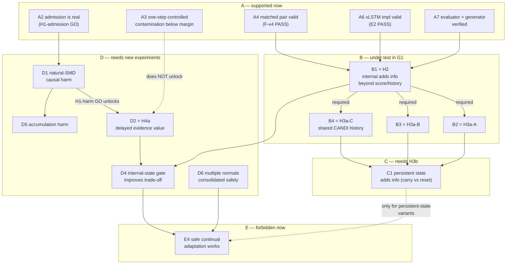

# Research claim map

Every row below is a *claim*, not a result. Tiers separate what the project may already assert from
what it is currently testing, what remains locked behind a later phase, and what must not be said at
all. The point of the tiering is that adjacent tiers are frequently confused in this literature —
"the internal state separates the classes" and "the internal state can drive an adaptation decision"
are two different claims with two different experiments behind them.

Nothing in this file states or assumes a G1 outcome.

---

## 0. The ladder that matters most

Five claims that sound alike and are not. Each level needs strictly more evidence than the one
above it, and the added requirement is named.

| Level | Claim | What the current design can say | What is additionally required |
|---|---|---|---|
| L1 | **Internal-state separability.** Frozen recurrent internal summaries carry information that discriminates anomaly windows from anomaly-free drift/transition windows, beyond a score/history control. | This is exactly what H2 tests, offline, with evaluator labels, on the frozen synthetic probe. | — |
| L2 | **Internal state is usable for an adaptation decision.** | Nothing. The probe is offline, supervised by evaluator labels, fit on source-disjoint folds, and never touches adaptation. | An online decision rule with no label access, a calibrated operating point chosen without test data, an explicit cost asymmetry (absorbing an anomaly vs. delaying a legitimate new normal), and a downstream safety/utility metric that improves. |
| L3 | **xLSTM internal state is specifically more useful.** | H3a tests whether the *information* is architecture-specific under a capacity- and pooling-matched schema. | A mechanism account (which gate/memory property produces the gain), robustness to the matched-schema choices, and — for any "detector" claim — a detection-performance comparison, which is not in the confirmatory family at all. |
| L4 | **Delayed adaptation improves contamination robustness.** | Nothing. H4a/H4b are locked behind unresolved H1 harm. | First a demonstrated harm to improve on (natural or controlled), then H4a's information result, then an intervention showing a better safety/latency trade-off at fixed update budget. |
| L5 | **Safe continual normality adaptation works in deployment.** | Nothing. | Real streams with defensible drift/anomaly annotations (or a proxy the protocol accepts), repeated/accumulating updates rather than one step, an explicit rollback/consolidation semantics, and an operational cost model. |

A positive H2/H3a licenses L1 (and L3's information half). It does not license L2, and the distance
from L1 to L2 is the project's largest single gap.

---

## A. Claims already supported by completed phases

Each row states the claim in the narrowest form the evidence supports, plus the scope limit that
must travel with it.

| ID | Claim | Evidence | Scope limit that must be quoted with it |
|---|---|---|---|
| A1 | The pinned CANDI release reproduces its own *released-artifact operational* behaviour on the sealed SMD anchor under release defaults. | C1-R PASS (bitwise replay equality, second machine, native label-permutation control) | Paper-table fidelity is a separate object and is **MISMATCH / UNRESOLVED_LINEAGE**: one row differs by 0.026996 and the author-cached arrays disagree with the published values too. |
| A2 | CANDI's test-time adaptation is genuinely seed-active, and true anomaly windows enter its candidate, committed and gradient-exposed sets. | C3: 5/5 effective seeds in all six machine/alpha conditions; committed contamination 1.58–4.06%; independently audited with stable window IDs | Admission is not harm. Two machines, one released checkpoint family, native FPM/SANA only. Repeated exposures on `machine-2-1` are re-exposures of the same committed windows, not new anomalies. |
| A3 | In a controlled single-update intervention with the official SANA operator, contamination at c ≤ 20% produced no AP loss reaching the frozen 0.02 margin. | D-v2: 4,800 rows, 12 comparisons, all below margin; largest effect collective c20 ≈ 2.8e-5 (CI [1.7e-5, 4.0e-5], Holm p = 0.0430) | This is **not** "contamination is harmless". One optimizer step, D=8 synthetic, frozen backbone, and an intervention whose own sensitivity is low (spike macro AP ≈ 0.008; post-shift fixed-threshold FPR ≈ 0.49). Accumulation over repeated updates is untested. |
| A4 | A matched xLSTM/LSTM pair can be trained under one identical contract with recurrent internals verified against an independent reference. | F-v4 PASS: eight fresh 50-epoch runs plus two carried by reference, all hard score/common18/recurrent/observer/reset/prefix gates | Validity only. No detection performance, no probe result, and no claim that the two architectures are equivalent beyond the matched contract. |
| A5 | The xLSTMAD submission version is invalid for internal-state observation in this setting. | Phase E: `[W,B,D]` output flattened against `[B,W,D]` targets in both training and scoring (batch-permutation failure, max 0.0867); dataset repeats the final window; native kernel parity not establishable under CUDA 13 | A statement about that implementation, not about xLSTM as an architecture. Retained as immutable evidence rather than repaired. |
| A6 | The improved official xLSTMAD implementation is valid and instrumented for this use. | E2: 40/40 checks PASS, including permutation, repartition, reset, prefix causality, observer parity, label isolation, no test-fitted scaler | Bounded validity/instrumentation. Says nothing about signal or performance. |
| A7 | The controlled generator realizes a correlation-only regime shift with matched marginals, and the evaluator enforces causality and label isolation. | Phase B: Lyapunov residual ≤1e-10, matched stationary moments ≤1e-10, off-diagonal correlation difference ≥0.2, 256-step transition diagonal deviation ≤1e-10, label-permutation and future-observation invariance tests | Software correctness, not realism. Dependency anomalies are not correlation-only; only the latent correlation-shift scenario has analytically equal marginals. |
| A8 | There exists a defensible real-data anchor (A1) and an outcome-blind external stress set (A2). | `phase_a/smd_seal.json`; `phase_a_v4/manifest.json` with explicit denominators | A2 carries 9/12 files with unresolved native provenance and a single-family periodic bucket; it clusters by source family and is never causal evidence for H2/H3/H4a. |

**What tier A does not contain.** No claim about drift-versus-anomaly identifiability, no claim about
internal-state information, no claim about any adaptation mechanism, and no real-data claim beyond
admission.

---

## B. Claims currently under test in G1

All four confirmatory members measure the **probe's** average precision on the binary task
"window contains an anomaly" versus "anomaly-free window inside an early transition or active
gradual drift", using features extracted from *frozen* detectors. None of them measures the
detectors' own anomaly-detection performance.

| ID | Claim (estimand) | Gate |
|---|---|---|
| B1 = **H2** | Window-local internal summaries add information beyond the 14-column score/history control for the same backbone: `AP(xLSTM history+combined248) − AP(xLSTM history14)`. | mean gain ≥ 0.02 **and** paired 95% CI lower bound > 0 **and** Holm-adjusted p < 0.05 **and** positive in ≥ 4/5 detector seeds **and** ≥ 3/4 shifted scenarios **and** duration macro ≥ 0.02 with ≥ 3/4 positive strata **and** severity macro ≥ 0.02 with ≥ 2/3 positive strata. Any failure ⇒ STOP. |
| B2 = **H3a-A** | The combined internal schema is more informative when taken from xLSTM than from the matched LSTM: `AP(xLSTM combined234) − AP(LSTM combined234) ≥ 0.02`. | Conditional on B1 GO; same confidence/multiplicity/reproducibility/robustness rules. |
| B3 = **H3a-B** | xLSTM's incremental gain over its own history control exceeds the LSTM's: `(AP(xLSTM hist+comb) − AP(xLSTM hist)) − (AP(LSTM hist+comb) − AP(LSTM hist)) > 0`. | Conditional on B1 GO. |
| B4 = **H3a-C** | The same incremental comparison survives when both arms share one frozen CANDI 14-column history, separating score-source differences from backbone differences. | Conditional on B1 GO and a uniquely resolved CANDI control (resolved by the G0.1 amendment). |

**Descriptive outputs of the same run that can never be promoted to confirmatory:** per-family
ablations (hidden52, gate130, memory52, history14 alone), specificity strata (stable new normal,
stationary normal), natural-prevalence evaluation, mixed drift+anomaly stress stratum,
persistent-fault stratum, and the identical-observation/opposite-semantic pair — which is an
*expected negative* control: identical observations must yield identical features and predictions,
so its AP can never support B1–B4.

**Claims B1–B4 cannot make even if they all pass:** that the gain is available online, that it is
achievable without evaluator labels, that it survives on real data, that gate values have semantic
meaning, or that any adaptation policy should act on them.

**The construct has precedent; the measurement is what is new.** Using a model-internal quantity as
adaptation evidence is the majority practice in the retrieved literature (34 of 78 records do it
explicitly), and at least one published method already feeds a filter's own internal signal into a
drift-versus-anomaly decision with an explicit non-commit action. So B1–B4 may not be framed as "we
introduce internal state as evidence". Their defensible framing is the controlled *measurement* —
frozen detectors, a matched score/history control, evaluator-side truth, pre-registered margins, and
a reportable null. See `positioning_table.md` for what each component must clear.

---

## C. Claims that require H3b

| ID | Claim | Precondition | Why it is separate |
|---|---|---|---|
| C1 | Carrying recurrent state across consecutive chunks adds information relative to independent per-window resets, for the same frozen xLSTM weights and the same input/history budget. | H3a GO; synthetic only; no optimizer updates; carry only within a source stream | H3b is still an **information** claim, on a longer state horizon. It is not xLSTMAD reproduction, not a detector improvement, and not evidence that persistent state is safe to adapt on. The protocol also forbids comparing carry against overlapping-window replay, which would double-consume observations. |

---

## D. Claims requiring later adaptation or intervention experiments

| ID | Claim | Blocked by | Experiment that would be required |
|---|---|---|---|
| D1 | Contaminated adaptation causes causal harm on natural SMD streams. | `H1_natural_harm = NOT_RUN` | The pre-registered counterfactual audit: match each actually-committed contaminated buffer against an equally sized clean counterpart drawn chronologically from previously available evaluator-verified normal candidates, with matched queue/age/schedule, requiring AP(clean) − AP(natural) ≥ 0.02, CI > 0, Holm across 2 machines × 3 alphas, ≥ 4/5 seeds. N/A if clean matches are unavailable. |
| D2 | Waiting K decision windows yields additional evidence about an ambiguous candidate (H4a). | H1-harm unresolved ⇒ H4a LOCKED | Frozen-trajectory diagnostic with candidate IDs fixed at t, features restricted to ≤ t+K, matched-capacity current-only arm, Holm across K ∈ {4,8,16,32}, positive in every time-position quartile. |
| D3 | FIFO scheduling changes the contamination/latency frontier (H4b). | H1-harm unresolved ⇒ H4b LOCKED | Descriptive only by design: no decontamination GO threshold exists, because FIFO cannot change the contamination fraction of a fixed cohort that is eventually fully committed. |
| D4 | A decision rule using internal-state evidence improves the safety/utility trade-off of adaptation. | Nothing in M0 authorizes it; the probe is explicitly forbidden from controlling adaptation | A new pre-registered intervention: an online gate with no label access, a cost-asymmetric operating point fixed on calibration data, and a paired comparison against both always-adapt and never-adapt baselines on the same stream and update budget. |
| D5 | Repeated contaminated updates accumulate harm even when one update does not. | D-v2 tested exactly one native SANA step | A multi-step version of the D-v2 design with the accumulation schedule pre-registered, and explicitly *not* justified post hoc by a negative single-step result. |
| D6 | Multiple coexisting "normals" (recurring A→B→A) can be consolidated without forgetting. | No representation of "new normal" exists in the current code | A mechanism-level experiment with a memory/prototype representation and a recurrence-specific metric; see `safe_adaptation_design_space.md`. |

---

## E. Claims that must not be made now

| ID | Prohibited claim | Why |
|---|---|---|
| E1 | "xLSTM is a better anomaly detector." | No confirmatory member compares detection performance. All four compare probe AP on the drift-vs-anomaly task. |
| E2 | "Internal state can be used to decide when to adapt." | L1 → L2 gap: offline, label-supervised, no operating point, no cost model, no online availability guarantee. |
| E3 | "xLSTM gates encode drift semantics." | The features are statistical summaries (mean/std/quantiles/deltas of effective gates). A positive result is equally consistent with gate summaries proxying reconstruction-error magnitude or input scale. Any semantic reading needs a separate mechanism experiment. |
| E4 | "Safe continual normality adaptation works." | No adaptation mechanism has been implemented or evaluated in this project. |
| E5 | "CANDI's adaptation is harmful" / "is harmless." | Admission is GO; controlled harm is STOP below margin; natural harm is NOT_RUN; overall UNRESOLVED. Both directions overstate. |
| E6 | "Results transfer across datasets" / "TSB-drift validates the method." | A2 is an external stress test with family-clustered inference and 9/12 unresolved native provenance. |
| E7 | "Delay decontaminates the update buffer." | For a fixed cohort that is eventually fully committed, FIFO preserves the contamination fraction exactly; any change comes from endogenous selection, which is secondary evidence at best. |
| E8 | "Drift and anomaly are identifiable from observations." | The generator deliberately contains paired identical observations with opposite semantic truth, and legitimate excursions with matched perturbations and durations. An irreducible non-identifiable region exists **by construction**; H2 can only speak about the remainder. |
| E9 | Any statement that merges quarantined artifacts (Phase-D v1 rows, xLSTMAD v1, F-v1/v2/v3 partials, author cache arrays, the quarantined G1 cache outputs) into an estimate. | Fail-closed rule; those artifacts are audit evidence, not data. |

---

## Claim dependency graph

Solid edges are protocol preconditions. The two dotted edges are the traps: a controlled negative
result does **not** unlock the delay branch (it leaves harm unresolved), and an H3b information
result does **not** by itself license a deployment claim.

---

## How to use this file when writing

1. Find the claim you are about to write in tiers A–E. If it is not there, it is probably a blend of
   two tiers — split it.
2. Copy the scope limit alongside it. In this project a claim without its limit is treated as a
   different, unsupported claim.
3. If the claim depends on a G1 member, check `reports/phase_g1/` for the adjudicated decision
   *after* the recovered post-run audit has passed. Until then, B1–B4 have no truth value in text.
