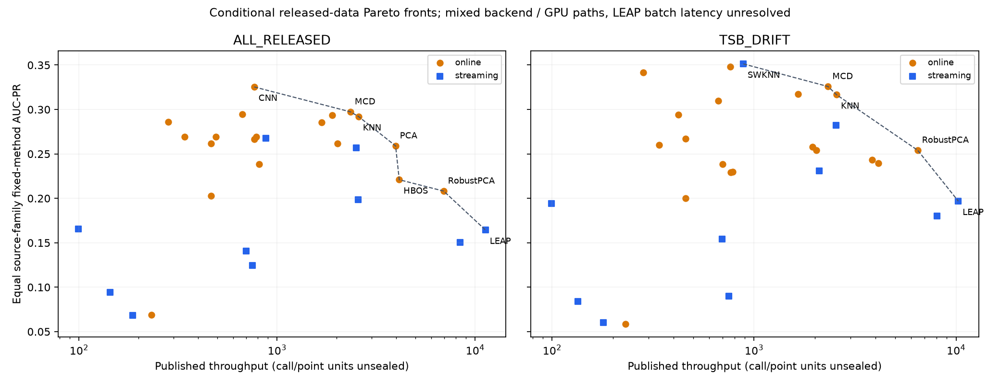

# D0 published accuracy / compute fronts

Objectives maximize fixed-method equal-family AUC-PR and mean of per-family median published throughput. These are descriptive points from two official tables, not freshly measured operational Pareto optima. Primary and harmonic/series-arithmetic sensitivity results are emitted for all subsets. Equal-family accuracy stays fixed in speed-aggregation sensitivity.

| subset | family-balanced median-speed front | harmonic-speed sensitivity |
|---|---|---|
| ALL_RELEASED | CNN, HBOS, KNN, LEAP, MCD, PCA, RobustPCA | CNN, HBOS, KNN, LEAP, MCD, PCA, RobustPCA |
| TSB_DRIFT | KNN, LEAP, MCD, RobustPCA, SWKNN | KNN, LEAP, MCD, MemStream, RobustPCA, SWKNN |
| MEASURED_SOURCE_ONLY | CNN, HBOS, KNN, LEAP, MCD, PCA, RobustPCA | CNN, HBOS, KNN, LEAP, MCD, PCA, RobustPCA |
| MEASURED_DRIFT | KNN, LEAP, MCD, RobustPCA, SWKNN | KNN, LEAP, MCD, MemStream, RobustPCA, SWKNN |

| subset | mode | method | auc_pr | throughput | family_median_inference_std | GPU_flag |
|---|---|---|---|---|---|---|
| ALL_RELEASED | online | CNN | 0.32533 | 767.38410 | 0.00023 | 1 |
| ALL_RELEASED | online | HBOS | 0.22093 | 4139.85205 | 0.00000 | 0 |
| ALL_RELEASED | online | MCD | 0.29732 | 2348.48828 | 0.00002 | 0 |
| ALL_RELEASED | online | KNN | 0.29199 | 2580.95976 | 0.00004 | 0 |
| ALL_RELEASED | online | PCA | 0.25902 | 3967.62844 | 0.00001 | 0 |
| ALL_RELEASED | online | RobustPCA | 0.20817 | 6937.81681 | 0.00000 | 0 |
| ALL_RELEASED | streaming | LEAP | 0.16430 | 11286.67264 | 0.00165 | 0 |
| TSB_DRIFT | online | MCD | 0.32581 | 2326.08346 | 0.00002 | 0 |
| TSB_DRIFT | online | KNN | 0.31651 | 2563.00728 | 0.00003 | 0 |
| TSB_DRIFT | online | RobustPCA | 0.25409 | 6458.96385 | 0.00001 | 0 |
| TSB_DRIFT | streaming | LEAP | 0.19684 | 10262.71121 | 0.00179 | 0 |
| TSB_DRIFT | streaming | SWKNN | 0.35126 | 885.23926 | 0.00008 | 0 |

ALL_RELEASED includes only LEAP as a Streaming point on the primary front; drift includes SWKNN/LEAP. MemStream enters the drift front under harmonic or series-arithmetic speed aggregation. SDOstream is on the simulated-source front, not necessarily the main family-balanced front. Thus the front changes with composition and aggregation; the source paper’s original series-average chart is not silently reproduced as a family-balanced claim.

Units are unresolved: the paper describes inference computations/second, source notebooks read precomputed mean_throughput, and raw run-time arrays are absent. LEAP emits32 scores only on full chunks and other calls are empty; its observed availability lag is0..31 samples. SWKNN forwards64 rows per overlapping-window callback, so callback count is not backend row count. These traces do not prove any actual timing bias or score difference; do not multiply/divide throughputs without a sealed timing definition.

GPU flags distinguish mixed hardware paths, but actual per-run device, concurrency, memory, training amortization, batch warm-up, p99 and rate deadlines are not sealed. std_inference is published inference-time **standard deviation**, not variance or a latency SLA. No actionable deployment recommendation is based on these fronts.

Apparent fronts should first be revalidated against a common point/call/availability contract and source-balanced workload. That is a protocol follow-up for the reviewer; D0 does not perform a benchmark rerun.

