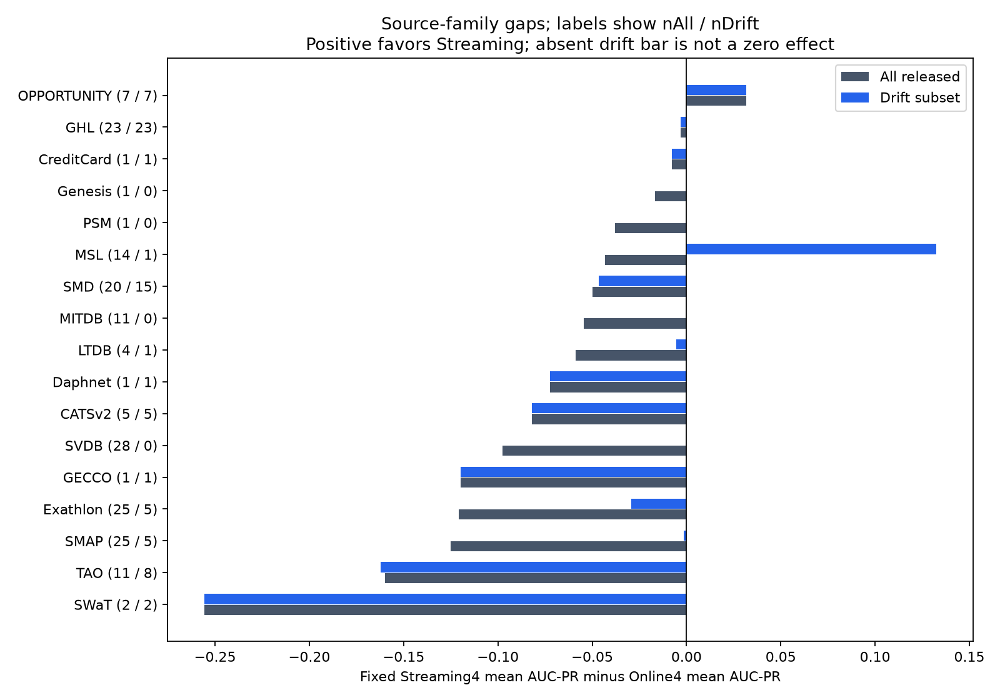

# D0 failure atlas — fixed comparisons first

Online fixed portfolio: CNN/USAD/TimesNet/KNN. Streaming fixed portfolio: SWKNN/MemStream/SDOstream/MCOD. Each score is the equal arithmetic mean of four released method AUC-PRs; this is a descriptive portfolio summary, not an ensemble or deployable model choice. Method lists are explicit in the Issue and analysis_rules; they were globally top performers in the source study, so they are not an independently held-out selection experiment.

## Q1: relative robustness and absolute accuracy

| subset | series | families | equal_family_online | equal_family_streaming | gap | series_median_gap |
|---|---|---|---|---|---|---|
| ALL_RELEASED | 180 | 17 | 0.29308 | 0.21821 | -0.07487 | -0.06247 |
| TSB_DRIFT | 75 | 13 | 0.30893 | 0.26115 | -0.04778 | -0.00017 |
| NON_DRIFT | 105 | 10 | 0.33660 | 0.25138 | -0.08522 | -0.08196 |
| MEASURED_SOURCE_ONLY | 151 | 14 | 0.33659 | 0.25230 | -0.08430 | -0.07160 |
| MEASURED_DRIFT | 46 | 10 | 0.37461 | 0.32175 | -0.05286 | -0.01007 |
| SIMULATED_SOURCE | 28 | 2 | 0.08380 | 0.04132 | -0.04248 | 0.00225 |
| UNKNOWN_SOURCE | 1 | 1 | 0.10238 | 0.09474 | -0.00764 | -0.00764 |

Online retains higher fixed-portfolio absolute AUC-PR under family weighting in all listed subsets. The drift-vs-non-drift raw-series drops are approximately−0.1073 Online and−0.0416 Streaming, but those subsets have different family composition. With equal-family weighting Online goes0.33660→0.30893 and Streaming0.25138→0.26115; this sign change in the Streaming cross-subset comparison illustrates why “degradation” is descriptive, not a paired causal drift effect. Within-family CD contrasts exist in only four families with>=2 rows per stratum.

Fixed-method exceptions are preserved: on the drift subset, family-balanced SWKNN0.35126 slightly exceeds CNN0.34796, while the Streaming4 portfolio mean remains lower. Category-wide superiority cannot be inferred from either a single named method or an oracle maximum. All29 fixed-method summaries and16 fixed cross-pairs are in results; no test-selected winning algorithm is promoted.

## Oracle reproduction (secondary envelope only)

| subset | Streaming wins | Online wins | median gap | label |
|---|---|---|---|---|
| ALL_RELEASED | 22 | 158 | -0.05685 | ORACLE_ENVELOPE |
| TSB_DRIFT | 18 | 57 | -0.02417 | ORACLE_ENVELOPE |
| NON_DRIFT | 4 | 101 | -0.09378 | ORACLE_ENVELOPE |

The preliminary22/158,18/57 and4/101 counts reproduce exactly. Online pool19 versus Streaming pool10 is an unequal-size performance envelope and uses test labels per series. It is not a deployable selector, adaptation benefit or fair equal-cardinality method policy. Drift-winning Streaming names: {'MCOD': 6, 'LODA': 5, 'MemStream': 2, 'RSHash': 2, 'SWKNN': 1, 'HSTree': 1, 'LEAP': 1}. The envelope is spread over seven winners; MCOD6 plus LODA5 account for11/18, not a universal Streaming algorithm.

## Q2: where wins occur

Every D>80 row is OPPORTUNITY:7/7 at248 features,4/7 oracle Streaming wins and5/7 fixed-portfolio wins. There is zero within-family high-D contrast support and no second high-D family; dimensionality and this family are inseparable. Across all180 rows only OPPORTUNITY has a positive family-mean fixed-portfolio gap. In CD, the additional positive MSL family consists of one drift series, not a replicated family pattern.

The predeclared robust Streaming-win rule (gap>=.05,>=.75 cross-pair wins, all method leave-one-out margins>=.02) leaves4 series in only MSL/SMD. That is below the>=3-family actionable requirement. Rows elsewhere can have small positive gaps but are not silently upgraded to robust failures.

## Q3: morphology, duration and prevalence

seq_anomaly=1 in all180; point_anomaly=1 in13, also with seq=1. There is no point-only stratum. The released fields cannot isolate point versus sequence behavior; they do not reveal severity, affected channels, temporal pattern shape or causal mechanism. Average event length and event count are informative descriptors, but avg length is algebraically positive-label count/event count and tightly coupled to prevalence/length.

Duration>100 has negative Streaming-minus-Online contrasts in MSL/SMAP/SMD (mean family contrast−.08732), but after matching the predefined prevalence bin, MSL flips to+.12452 while SMAP/SMD remain negative. Prevalence>.05 has material negative contrasts in five families; this may reflect task/prevalence/metric interaction, not a proved adaptation failure. These label-derived descriptors are evaluator axes, not online routing features. No iid p-values are computed.

## Change-point and drift tags

Change-point versus non-tagged series shows positive relative-gap contrasts in Exathlon/SMAP/SMD and remains positive under family leave-one-out; it is a genuine **descriptive association**. Within CD=1, however, only SMAP/SMD provide positive measured-family contrasts; simulated GHL is negative and other family cells are unsupported. Method removals alter which families exceed the material margin. It cannot isolate a change-point mechanism from drift membership/source/method composition or execution artifacts.

continuous/change_point/periodic/random_walk counts45/53/8/41 are nonexclusive. Results/strata.json gives all bins and family support; results/family_conditioned_contrasts.csv and within_drift_family_tag_contrasts.csv preserve unsupported cells and paired strata. No exact drift/recovery time or benign semantics is fabricated.

## Q4/Q5 and actionability

Static→Online deltas, fit-scope differences and warm-up timing are audited separately in STRAD_PROTOCOL_AUDIT.md; causality/padding contributions cannot be quantitatively separated without raw score vectors. Efficiency fronts are conditional released-data summaries in EFFICIENCY_PARETO.md, with batch/hardware/aggregation limitations. No observational descriptor is converted into a new controller, selector, temporal backbone claim or CANDI/xLSTM prescription.

