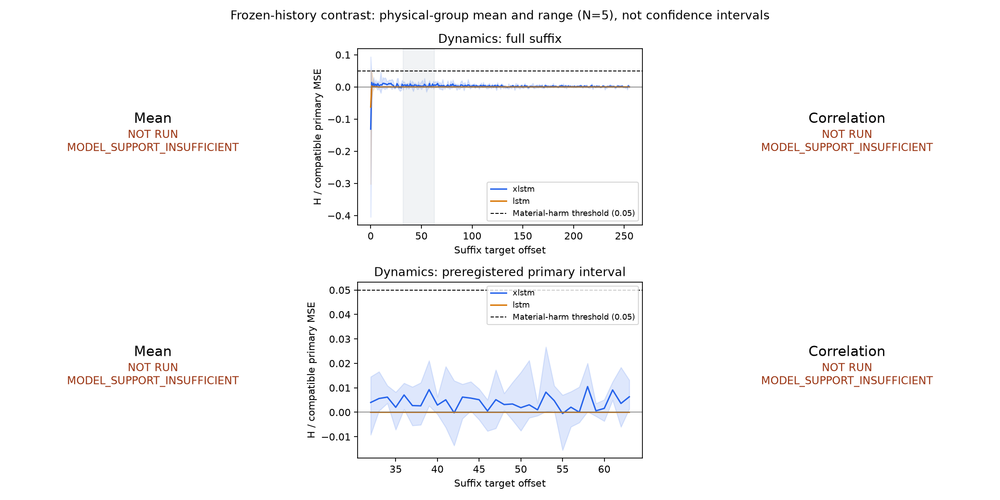

# M0-S results

**Final gate: `NO_STATE_STALENESS_SIGNAL`. STOP for reviewer.**

Original protocol freeze: `ec87d80846f58caf504800079c17839e5a3acba0`; environment-only amended freeze: `3da4fee4979eb09b0338463c1e3dc4758d4513ce`. 90 training runs, 90 support audits, 30 paired mechanism runs, 0 anomaly extensions. Anomaly stage: `NOT_RUN_GATED`.

Three mechanisms are reported independently. Scientific N=5 physical groups within each mechanism; model seeds and eight common-suffix realizations are paired replicates. Mechanisms reuse the same five group transforms and are not pooled as N=15 independent evidence. No iid p-values, model-seed bootstrap or winner selection.

| Mechanism | Final gate | xLSTM support groups | LSTM support groups |
|---|---|---|---|
| mean | `MODEL_SUPPORT_INSUFFICIENT` | 5/5 | 0/5 |
| dynamics | `NO_STATE_STALENESS_SIGNAL` | 5/5 | 5/5 |
| correlation | `MODEL_SUPPORT_INSUFFICIENT` | 5/5 | 1/5 |

## B-support gate

Each group requires >=2/3 seeds with B-compatible MSE <=0.98 times the best last-value/moving-mean baseline AND <=1.25 times independently B-trained linear AR. If either backbone passes fewer than 4/5 groups, that mechanism stops before incompatible-history inference. This is a task-fit gate, not evidence that every regime/forecast setup is learnable.

| Mechanism | Group | Backbone | Seeds passing | Median ratio vs simple | Median ratio vs B-AR |
|---|---|---|---|---|---|
| mean | 0 | xlstm | 3/3 | 0.5200 | 1.1126 |
| mean | 0 | lstm | 0/3 | 0.8632 | 1.8468 |
| mean | 1 | xlstm | 3/3 | 0.4773 | 1.1096 |
| mean | 1 | lstm | 0/3 | 0.8454 | 1.9655 |
| mean | 2 | xlstm | 3/3 | 0.4285 | 1.1411 |
| mean | 2 | lstm | 0/3 | 0.8631 | 2.2987 |
| mean | 3 | xlstm | 2/3 | 0.4044 | 1.1749 |
| mean | 3 | lstm | 0/3 | 0.8563 | 2.4879 |
| mean | 4 | xlstm | 2/3 | 0.3749 | 1.2366 |
| mean | 4 | lstm | 0/3 | 0.8606 | 2.8386 |
| dynamics | 0 | xlstm | 3/3 | 0.9199 | 1.0430 |
| dynamics | 0 | lstm | 3/3 | 0.9367 | 1.0620 |
| dynamics | 1 | xlstm | 3/3 | 0.8876 | 1.0447 |
| dynamics | 1 | lstm | 3/3 | 0.9079 | 1.0686 |
| dynamics | 2 | xlstm | 3/3 | 0.8595 | 1.0452 |
| dynamics | 2 | lstm | 3/3 | 0.8964 | 1.0901 |
| dynamics | 3 | xlstm | 3/3 | 0.7943 | 1.0441 |
| dynamics | 3 | lstm | 3/3 | 0.8483 | 1.1151 |
| dynamics | 4 | xlstm | 3/3 | 0.7927 | 1.0607 |
| dynamics | 4 | lstm | 3/3 | 0.8527 | 1.1411 |
| correlation | 0 | xlstm | 3/3 | 0.4939 | 1.0510 |
| correlation | 0 | lstm | 3/3 | 0.5770 | 1.2278 |
| correlation | 1 | xlstm | 3/3 | 0.4784 | 1.0695 |
| correlation | 1 | lstm | 0/3 | 0.5822 | 1.3014 |
| correlation | 2 | xlstm | 3/3 | 0.4083 | 1.0914 |
| correlation | 2 | lstm | 0/3 | 0.5034 | 1.3455 |
| correlation | 3 | xlstm | 3/3 | 0.3963 | 1.0600 |
| correlation | 3 | lstm | 0/3 | 0.5433 | 1.4533 |
| correlation | 4 | xlstm | 3/3 | 0.3675 | 1.0948 |
| correlation | 4 | lstm | 0/3 | 0.5067 | 1.5098 |

## mean: `MODEL_SUPPORT_INSUFFICIENT`

Paired history experiment NOT_RUN_GATED: insufficient matched model support. Do not call any A→B state effect.

## dynamics: `NO_STATE_STALENESS_SIGNAL`

Primary offsets 32–63: all compared recent suffix observations already identical. Values below are physical-group averages over three fixed model seeds; gates require >=2 seeds jointly, not separate witnesses. Recovery is KEEP-minus-oracle-reset divided by compatible primary MSE.

| Group | Backbone | Mean H | Seed H range | Mean R | Long benefit L8 | Long benefit L32 | Pre-AD gate | Full forecast gate |
|---|---|---|---|---|---|---|---|---|
| 0 | xlstm | 0.002916 | [0.000187, 0.007100] | 0.003057 | 0.005864 | 0.001452 | False | False |
| 1 | xlstm | 0.004526 | [0.002213, 0.008994] | 0.002184 | 0.011252 | 0.002353 | False | False |
| 2 | xlstm | 0.008372 | [-0.001154, 0.013195] | 0.004468 | 0.011259 | 0.002312 | False | False |
| 3 | xlstm | 0.001347 | [-0.000684, 0.005150] | -0.000864 | 0.013427 | 0.001831 | False | False |
| 4 | xlstm | 0.003004 | [-0.000310, 0.006588] | 0.000459 | 0.014222 | 0.001996 | False | False |

xlstm: group median H=0.003004, range=[0.001347,0.008372], signs=['+', '+', '+', '+', '+'].

| Group | Backbone | Mean H | Seed H range | Mean R | Long benefit L8 | Long benefit L32 | Pre-AD gate | Full forecast gate |
|---|---|---|---|---|---|---|---|---|
| 0 | lstm | 0.000000 | [-0.000000, 0.000000] | -0.000000 | 0.000000 | 0.000000 | False | False |
| 1 | lstm | -0.000000 | [-0.000000, -0.000000] | -0.000000 | -0.000421 | 0.000000 | False | False |
| 2 | lstm | -0.000000 | [-0.000000, 0.000000] | -0.000000 | 0.000155 | 0.000000 | False | False |
| 3 | lstm | 0.000000 | [-0.000000, 0.000000] | -0.000000 | 0.000233 | 0.000000 | False | False |
| 4 | lstm | 0.000000 | [-0.000000, 0.000000] | -0.000000 | 0.000512 | 0.000001 | False | False |

lstm: group median H=0.000000, range=[-0.000000,0.000000], signs=['+', '-', '-', '+', '+'].

Offset-bin summaries (mean of five group means; descriptive, never windows-as-N):

| Backbone | Offsets | H normalized | R normalized |
|---|---|---|---|
| xlstm | 0–7 | -0.010054 | -0.022217 |
| xlstm | 8–15 | 0.007817 | 0.002584 |
| xlstm | 16–31 | 0.004878 | 0.001335 |
| xlstm | 32–63 | 0.004033 | 0.001861 |
| xlstm | 64–127 | 0.003364 | 0.002871 |
| xlstm | 128–255 | 0.001256 | 0.001153 |
| lstm | 0–7 | -0.007122 | -0.000994 |
| lstm | 8–15 | -0.000043 | -0.000279 |
| lstm | 16–31 | -0.000000 | 0.000009 |
| lstm | 32–63 | -0.000000 | -0.000000 |
| lstm | 64–127 | -0.000000 | 0.000000 |
| lstm | 128–255 | -0.000000 | 0.000000 |

Onset/peak/half-life/recovery/censoring are retained for every fixed run in `mechanism.json`. The unsmoothed replicate-mean curve is descriptive and can oscillate; duration is never used to select a gate or model.

AD extension NOT_RUN_GATED: fewer than four xLSTM groups pass the pre-AD mechanism gate. No AP, event recall, attenuation or reset-safety conclusion is claimed.

## correlation: `MODEL_SUPPORT_INSUFFICIENT`

Paired history experiment NOT_RUN_GATED: insufficient matched model support. Do not call any A→B state effect.

## Limits and stop

The result concerns these fixed Gaussian VAR mechanisms, model capacities, training budget, primary offsets and finite horizon. No effect outside that setup is excluded. Spliced history is a controlled counterfactual; independently sampled common suffixes are not asserted to be physically continuous transitions. Continuous stationary A/B controls diagnose long-carry artifacts.

All selected checkpoints were chosen using only stationary validation forecasting MSE. Scalers use balanced normal training samples, thresholds (if AD runs) use separate stationary calibration only, and test weights remain frozen. The first boundary score is immutable; RESET changes ingestion of the first suffix observation and forecasts from offset1 onward. No unscored warmup timestamps are erased from comparison.

No TSB-drift, real labels, detector/controller, retention coefficient, bank, RL or parameter TTA was run. An oracle reset is a diagnostic. A positive result is neither novelty evidence nor authorization for a deployable policy; a negative or model-support failure does not justify tuning after outcomes.

Stop here for external review. Protocol changes require a separately documented amendment before another run.

## Interpretation and audit record

The qualified negative result is restricted to dynamics. xLSTM group-mean H is positive in all five groups but small: median **0.3004%** of compatible forecasting MSE, range **0.1347%–0.8372%**, versus the prospective **5%** material-harm threshold. None of the 15 xLSTM dynamics seed runs reaches that threshold. This is not a claim that every history effect is exactly zero. Matched LSTM effects in the primary interval are at floating-point noise scale. Fixed-L32 compatible loss differences are 0.1452%–0.2353% at group level, below the predeclared 2% long-context-benefit margin.

Mean/correlation are **unresolved mechanism tests**, not negative evidence of staleness: matched-LSTM B-support failed under this fixed training budget. xLSTM's better compatible forecasting fit there is not evidence of an xLSTM-specific state-content interaction. No budget, architecture or baseline was changed to rescue these gates. The B gate verifies B task adequacy; balanced A/B training support is established, but equal adequate forecasting in both regimes is not independently proven by that gate alone.

These VAR(1) processes have a short optimal conditional predictive structure within each known regime. The result does not rule out staleness in processes that require longer latent history, different training objectives or capacities. Neither the small positive xLSTM differences nor its support advantage justifies a controller, bank, retention coefficient or novelty claim.

Execution took **2,091.58 seconds (34.86 minutes)** after the amended start, using CPU. All90 runs completed30 epochs and120 updates (10,800 optimizer updates), with deterministic source/data/scaler/selection checks. Original v1 failed before its first update due CPU optimizer/CUDA fork initialization;90 empty directories, no checkpoints or scientific outcomes. The failure log, explicit A1 amendment and unchanged-science hashes remain preserved. A1 changed spawn/CPU visibility only; all scientific definitions match original Commit A.

The frozen summary renderer's original figure is preserved as `results/frozen_summary_history_harm.png`. `results/plot_history_harm.py` provides presentation-only labels for gated panels and the dynamics legend/primary zoom using the same saved curves, with no changed statistics or decisions.

**STOP.** Dynamics does not meet the practical persistent-staleness gate. Mean/correlation need a new prospective adequacy design before any renewed comparison. AD sensitivity, reset-induced attenuation and real-world applicability remain untested. Await reviewer; do not start M1 or tune these results.
