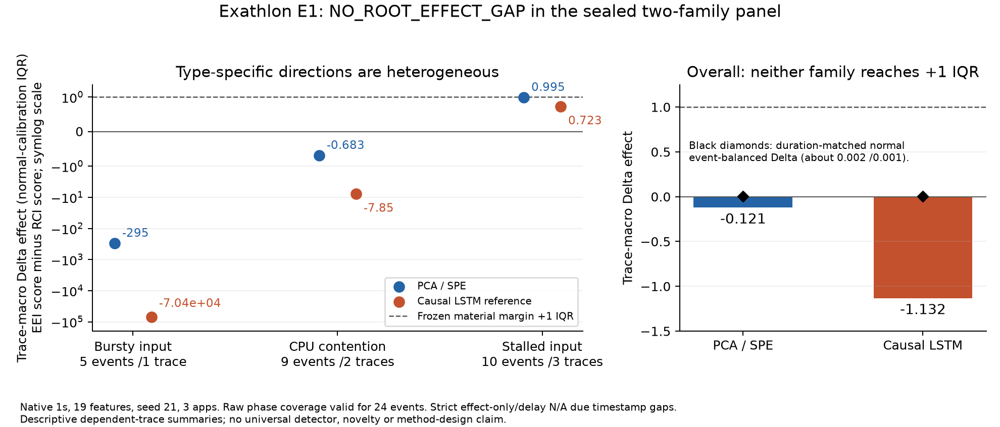

# E1 bounded lifecycle falsification results

**NO_ROOT_EFFECT_GAP**. Seal commit `e971f592b8bcd269719de2027bca238812b1203a` preceded all model training/inference. No model/metric/type/threshold change after outcome inspection. PCA/SPE and CAUSAL_LSTM_REFERENCE executed once, seed21, native1s,19 features; TranAD NOT_RUN prospectively.

## Raw phase evidence

| baseline | primary_events | eligible_events | eligible_types | eligible_apps | trace_macro_Delta | stationary_event_balanced_Delta | paired_normal_excess_Delta | complete_RCI_alarm_events | effect_only_rate | heldout_normal_FPR |
| --- | --- | --- | --- | --- | --- | --- | --- | --- | --- | --- |
| PCA_SPE | 24 | 24 | 3 | 3 | -0.12078079781520895 | 0.002086471266418934 | -0.17587905033620044 | 0 | None | 0.0 |
| CAUSAL_LSTM_REFERENCE | 24 | 24 | 3 | 3 | -1.131805478416729 | 0.0011475614319856886 | -1.9861200812186273 | 0 | None | 0.0002029890132196595 |

Trace-macro medians prevent a trace containing many events from automatically dominating. Confidence/significance/population universality are not inferred from dependent event/control counts. Material threshold is1normalIQR, fixed before outcomes. Positive sign alone does not pass.

| baseline | group | value | events | traces | trace_macro_Delta | median_Z_RCI | median_Z_EEI |
| --- | --- | --- | --- | --- | --- | --- | --- |
| PCA_SPE | anomaly_type | bursty_input | 5 | 1 | -294.86583795987957 | 302.8626589340805 | 1.0247134110103624 |
| PCA_SPE | anomaly_type | cpu_contention | 9 | 2 | -0.6826962536941056 | 0.45738087854808285 | 0.05245229471175459 |
| PCA_SPE | anomaly_type | stalled_input | 10 | 3 | 0.9946186714697299 | -1.042836450934454 | -0.04821777946472405 |
| PCA_SPE | app | 6 | 8 | 2 | -147.41885602795267 | 63.89283146694413 | 0.24799447116394552 |
| PCA_SPE | app | 9 | 8 | 2 | -0.05054316815691001 | -0.2760431522608404 | -0.02845576664064931 |
| PCA_SPE | app | 10 | 8 | 2 | 0.3754646994095372 | 0.22647917175612134 | 0.04534575404781095 |
| CAUSAL_LSTM_REFERENCE | anomaly_type | bursty_input | 5 | 1 | -70392.6697023108 | 70398.46391442014 | 1.0050315678393098 |
| CAUSAL_LSTM_REFERENCE | anomaly_type | cpu_contention | 9 | 2 | -7.846011981150523 | 8.220997904177024 | 0.604888767831066 |
| CAUSAL_LSTM_REFERENCE | anomaly_type | stalled_input | 10 | 3 | 0.7227997796949638 | -0.7038090501031022 | 0.1178508047089473 |
| CAUSAL_LSTM_REFERENCE | app | 6 | 8 | 2 | -35196.448144381575 | 2958.3460810452634 | 0.14632110044603422 |
| CAUSAL_LSTM_REFERENCE | app | 9 | 8 | 2 | -6.368359960673089 | 2.9370211074097203 | 0.26591783017299075 |
| CAUSAL_LSTM_REFERENCE | app | 10 | 8 | 2 | -0.6571123623956079 | 2.5388222012426818 | 0.23652136144817523 |

## Root capture burden and controls

| baseline | primary_observed_root_capture | normal_event_balanced_observed_root_capture | primary_median_root_alarm_fraction | normal_event_balanced_root_alarm_fraction | stationary_controls | pre_event_controls |
| --- | --- | --- | --- | --- | --- | --- |
| PCA_SPE | 0.9166666666666666 | 0.0 | 0.20744988865 | 0.0 | 720 | 24 |
| CAUSAL_LSTM_REFERENCE | 1.0 | 0.06609195402298851 | 0.2914171123 | 0.0 | 696 | 24 |

Observed capture is not proof of complete root-time absence. Missing native timestamps censor strict effect-only/delay fields even when phase medians remain eligible. Duration-matched controls overlap and share normal traces; no iid count claims. No-impact pseudo60s post and crash censoring rows are retained in control/event files, not primary.

## Calibration and continuity

| baseline | trace | app | role | median | IQR | global_FPR | app_threshold_FPR |
| --- | --- | --- | --- | --- | --- | --- | --- |
| PCA_SPE | 6_0_50000_48 | 6 | validation | 0.0195871807 | 0.1436723894 | 0.0019127774 | 0.0022953328 |
| PCA_SPE | 6_0_50000_49 | 6 | calibration | 0.0478055338 | 0.206295556 | 0.0 | 0.0052375608 |
| PCA_SPE | 6_0_50000_51 | 6 | normal_control | 0.0162189488 | 0.100170659 | 0.0 | 0.0014975665 |
| PCA_SPE | 9_0_100000_3 | 9 | validation | 0.0117212657 | 0.0333247355 | 0.0015055706 | 0.0015055706 |
| PCA_SPE | 9_0_300000_5 | 9 | calibration | 0.1283529515 | 1.4469497168 | 0.0065969699 | 0.0050129517 |
| PCA_SPE | 9_0_100000_6 | 9 | normal_control | 0.054256635 | 0.2060831296 | 0.0 | 0.0 |
| PCA_SPE | 10_0_100000_9 | 10 | validation | 0.0434996339 | 0.1048297049 | 0.0406109111 | 0.0430224024 |
| PCA_SPE | 10_0_100000_10 | 10 | calibration | 0.0687421604 | 0.2153511903 | 0.0 | 0.0050367261 |
| PCA_SPE | 10_0_100000_11 | 10 | normal_control | 0.0695301901 | 0.1895004212 | 0.0 | 0.00167059 |
| CAUSAL_LSTM_REFERENCE | 6_0_50000_48 | 6 | validation | 0.3862880021 | 0.2774548903 | 0.0019364833 | 0.0081332301 |
| CAUSAL_LSTM_REFERENCE | 6_0_50000_49 | 6 | calibration | 0.3602134883 | 0.3405638188 | 0.0 | 0.0053010223 |
| CAUSAL_LSTM_REFERENCE | 6_0_50000_51 | 6 | normal_control | 0.1524587125 | 0.2817723416 | 0.0 | 0.004547177 |
| CAUSAL_LSTM_REFERENCE | 9_0_100000_3 | 9 | validation | 0.0471082181 | 0.1252651419 | 0.0009121313 | 0.0009121313 |
| CAUSAL_LSTM_REFERENCE | 9_0_300000_5 | 9 | calibration | 0.3129674494 | 3.4523874819 | 0.0062540838 | 0.0050032671 |
| CAUSAL_LSTM_REFERENCE | 9_0_100000_6 | 9 | normal_control | 0.1323093697 | 0.2707597744 | 0.0 | 0.0 |
| CAUSAL_LSTM_REFERENCE | 10_0_100000_9 | 10 | validation | 0.2632893771 | 0.3790295459 | 0.0400700525 | 0.0416462347 |
| CAUSAL_LSTM_REFERENCE | 10_0_100000_10 | 10 | calibration | 0.2804042399 | 0.3815030456 | 0.0012620066 | 0.0050480264 |
| CAUSAL_LSTM_REFERENCE | 10_0_100000_11 | 10 | normal_control | 0.2312313169 | 0.3205947578 | 0.000608967 | 0.0025881099 |

Calibration FPR is in-sample descriptive; heldout normal_control FPR is independent. A q.995 calibration quantile does not guarantee0.5% heldout FPR. App-conditioned thresholds were frozen secondary, not selected by test labels. Exact-normal-context support is flagged per event and is not a matched-control claim. Event JSON includes raw score continuity, alarm fragments/run lengths, pre/recovery support and censoring; none implies a novel smoothing method.

Runtime: {'python': '3.14.6 (main, Jul 24 2026, 21:05:21) [Clang 21.0.0 (clang-2100.1.1.101)]', 'torch': '2.9.0', 'numpy': '2.5.3', 'pandas': '3.0.6', 'hardware': 'macOS-27.0.1-arm64-arm-64bit-Mach-O', 'threads': 2, 'device': 'cpu'}; 60824 scaler/PCA fit points; 7589 LSTM fit windows; wall time 20.3s. Final-epoch checkpoint; normal validation losses are [training record](results/training.json). Complete causal score/checkpoint hashes: [artifact ledger](provenance/score_artifacts.json).

[Review and limitations](REVIEW_NOTES.md), [verification](provenance/result_verification.json), [independent checks](provenance/independent_checks.json), [verification amendment01](AMENDMENT_01.md) / [amendment02](AMENDMENT_02.md), [figure PDF](results/lifecycle_contrast.pdf).

