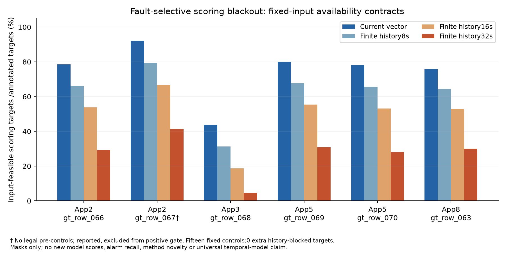

# N2 external observability replication

**FAULT_SELECTIVE_BLACKOUT_REPLICATED**. Five controlled holdout events across4 apps pass the prospective25% material margin. Six events were reported; one has0 legal pre-controls and remains unsupported. No event/window/control replacement.

| event /app | current-vector availability | strict32-history availability | additional event-time loss | fixed controls |
|---|---:|---:|---:|---:|
|gt_row_066 /2|78.46%|29.23%|49.23pp|3|
|gt_row_067 /2|92.06%|41.27%|50.79pp|0|
|gt_row_068 /3|43.75%|4.69%|39.06pp|3|
|gt_row_069 /5|80.00%|30.77%|49.23pp|3|
|gt_row_070 /5|78.12%|28.12%|50.00pp|3|
|gt_row_063 /8|75.71%|30.00%|45.71pp|3|

All15 fixed eligible controls have current-vector availability>=98.44%; their history-only additional loss is0 in every control, not only the median. Driver-labelled current-vector availability is43.75–92.06%, while strict32-history availability is4.69–41.27%. These are scoring opportunity fractions, **not alarm recall, fault accuracy, or results from retrained models**.

Changing the finite-history availability requirement on identical fixed inputs blocks25–32 otherwise-current-scorable target instants inside the driver-labelled intervals. In all6 recovery episodes, the first strict32-history opportunity occurs32s after the preprocessed feature vector becomes finite again; one comes after annotation end. This lag is input-feasibility recovery, not measured alarm latency. W8/16 structural diagnostics are reported without model-performance claims.

The data demonstrate a concrete failure mechanism: apparent normal input health can coexist with fault-selective scoring blackout, and history requirements amplify the missingness. The strict policy is conditional on the frozen19-feature causal preprocessing, including5s forward fill; this is not an inherent LSTM/xLSTM limitation or a claim that every partial-observation predictor must abstain.

Controls are annotation-clean pre-event intervals, not independently certified healthy physical units. Known overlap/context flags remain; one app5 executor context is unknown. Spark fault injections, shared cluster runs, one fault family and tiny event counts prevent independent-fleet or significance claims. No future fill, target imputation beyond the frozen policy, weight/threshold change or lifecycle rescue occurred.

Execution seal `648016f67ac966452efdfc175b88f7d1e0ae6dd9` was pushed/remote-verified before these event/control outcomes. Independent scalar enumeration matches 407844 complete-trace endpoint contracts and 30 interval counts;5 source/array and5 mask hashes,4 boundary/causality tests, controls and gate checks PASS. This is separate code verification by the same agent, not external peer review.

[Prior-art and research positioning](PRIOR_ART.md), [protocol](configs/protocol.json), [all events](results/primary_events.csv), [controls](results/controls.json), [input recovery](results/input_recovery.json), [verification](provenance/verification.json). Method design/novelty GO remain false. The validated result supports a new availability-aware evaluation question; it does not establish detector repair utility.

