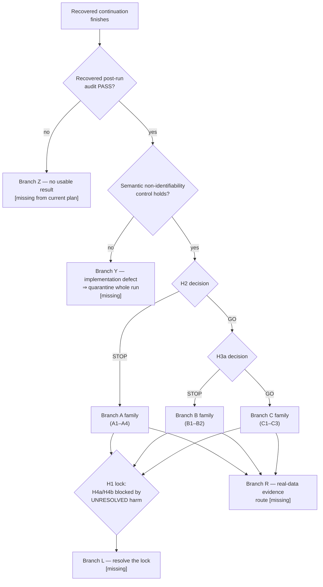

# Post-G1 research decision tree

A decision tree, not a roadmap: continuation is one option among stop and redirect, and several
branches below end the line deliberately. Each branch states the scientific interpretation, which
hypothesis survives, which dies, the next experiment, the falsification criterion for that next
experiment, and the recommended disposition.

Branches marked **[missing]** are not represented in the current project plan; they are the main
contribution of this document. Nothing here assumes a G1 direction.

---

## 0. The gate before all others: is there a result at all?

---

## Branch Z — the recovered post-run audit does not pass **[missing]**

**Interpretation.** A lineage, hash, prediction, statistic or decision-consistency violation means
the recovered execution is not admissible evidence, exactly as the first labeled run was not. This
is an execution-integrity outcome, not a scientific one.

**Survives / dies.** No hypothesis changes status. H2/H3a remain untested.

**Next decision (a cost decision, and it should be made explicitly rather than by reflex):**

| Option | Cost | When it is right |
|---|---|---|
| Re-audit after fixing the *auditor* (if the violation is in the audit tooling, not the run) | low | The violation is in a check's own lineage requirement, e.g. `HEAD` moved, a report path changed |
| Fresh labeled execution from the sealed pre-label seal | ≈3 days wall time, ≈500 GB, new post-label exposure | The violation touches predictions, statistics or decision consistency |
| Abandon the cache route and re-plan the probe at smaller scale | medium | Repeated integrity failures indicate the execution design, not the code, is too large to audit |

**Falsification criterion for the chosen option.** A re-run is only admissible if the audit passes on
the first attempt of the new execution; a second post-label repair cycle on the same question should
be treated as evidence that the experiment is not executable as specified.

**Disposition.** Do not interpret any partial artifact. Do not "salvage" the AP table.

---

## Branch Y — the semantic non-identifiability control fails **[missing]**

**Interpretation.** Identical observations with opposite semantic truth must produce identical
features and identical frozen-probe predictions. A difference means evaluator metadata leaked into
the observation-only path — an implementation defect by the protocol's own definition.

**Survives / dies.** Nothing survives from that run: a leak invalidates the primary comparisons too,
because the same extractor produced them.

**Next experiment.** Localize the leak (extractor, row-key construction, or cache write path), fix it
under a fresh pre-label seal, and re-execute. The old cache becomes audit evidence only.

**Falsification criterion.** The fix is only accepted if the control passes *and* a bounded replay
reproduces previously sealed non-leaking quantities bit-for-bit.

**Disposition.** Stop, quarantine, re-seal. This branch is cheap to describe and expensive to
execute, which is precisely why it should be pre-written.

---

## Branch A family — H2 = STOP

### A1. Redundancy: the score/history control is near-sufficient

**Interpretation.** In this regime, the reconstruction score and its causal history capture nearly
all the instantaneous evidence available; internal summaries are correlated decoration.

**Survives.** The evaluator, generator, matched-training contract, and the *question* of what
evidence exists beyond the score.
**Dies.** Window-local internal-state features as a research direction; H3a and H3b by protocol.

**Next experiment.** Temporal evidence instead of richer instantaneous features: the H4a-style
delayed-evidence diagnostic (matched-capacity current-only arm versus future-window summaries),
which is backbone-independent by design.
**Falsification criterion.** If delayed evidence also fails to reach the practical margin with
adequate stratum support, the observational route to drift-vs-anomaly discrimination in this regime
is closed and the project should redirect to mechanism-level questions (cost-sensitive policies under
acknowledged ambiguity) or stop.
**Disposition.** Redirect.

### A2. Weak identifiability: both arms near chance

**Interpretation.** A 64-step window at these severities does not decide the question, for any of the
feature families.

**Survives.** The instrument and the negative result as a published constraint.
**Dies.** The features-versus-features framing entirely.

**Next experiment.** A regime study *before* any new feature work: vary window length, severity and
drift rate in the generator to map where the task becomes decidable at all, reported as a
descriptive identifiability surface (not a confirmatory test).
**Falsification criterion.** If no accessible region of the regime space yields separability well
above the constructed non-identifiable floor, the problem statement — not the method — needs to
change (e.g. to "decide under irreducible ambiguity with an explicit cost model").
**Disposition.** Redirect, and consider this the most scientifically interesting negative outcome.

### A3. Unstable information: pooled gain with inconsistent sign

**Interpretation.** Any signal present is not reproducible under the frozen ≥4/5 seeds and ≥3/4
scenarios rule.

**Survives.** Nothing positive; the reproducibility rule proves its worth.
**Dies.** The claim, and any temptation to report the pooled mean alone.

**Next experiment.** Variance decomposition (across detector seeds versus source realizations) to
determine whether the instability is a training-seed effect or a data-realization effect, then a
power calculation for what a stable design would require.
**Falsification criterion.** If the required number of detector seeds or test sources for a stable
estimate exceeds the project's compute envelope, declare the design infeasible rather than
under-report it.
**Disposition.** Stop the claim; publish the instability as a methodological finding.

### A4. Regime-restricted gain: primary reaches margin, robustness strata fail

**Interpretation.** Information exists for some event durations or severities but not across the
pre-registered spread; per protocol H2 is STOP.

**Survives.** A *new, narrower* hypothesis about the specific regime.
**Dies.** The general H2 claim. It may not be reported as GO, and the strata may not be merged.

**Next experiment.** A fresh pre-registered test restricted to that regime, with its own power
analysis and its own Holm family — and with the honest acknowledgement in the paper that the
restriction was chosen after seeing the first result.
**Falsification criterion.** The restricted hypothesis fails if the gain does not replicate on new
test sources drawn for that regime.
**Disposition.** Redirect, with explicit provenance of how the narrower hypothesis arose.

---

## Branch B family — H2 = GO, H3a = STOP

### B1. Model-agnostic recurrent-state evidence

**Interpretation.** Recurrent internal state carries incremental information; no evidence it is
xLSTM-specific under the matched schema.

**Survives.** H2; the model-agnostic mechanism direction.
**Dies.** The architectural novelty claim; H3b (locked by protocol).

**Next experiment.** In order: (i) minimal sufficient internal summary via a pre-registered nested
comparison; (ii) a matched **non-recurrent** control carrier, which the current design lacks
entirely; (iii) an error-magnitude partialling test against a wider score-only family at equal
column budget.
**Falsification criterion.** The direction dies if the gain is fully explained by score-derived
quantities obtainable without internal access, or if a non-recurrent carrier matches it.
**Disposition.** Redirect toward a detector-agnostic mechanism — and accept that this places the work
directly beside the existing selective-adaptation literature, where an information result alone is
not a contribution (see `positioning_table.md`).

### B2. H3a-C fails alone — the apparent advantage was a score-source artifact **[missing]**

**Interpretation.** When both arms consume one shared frozen CANDI history, the backbone difference
disappears: what looked like an architecture effect was a difference in the *score* each backbone
supplies to its own history control.

**Survives.** H2 (the internal-state increment) and, importantly, the design choice of including a
shared-history member at all.
**Dies.** Any architecture-specific reading. This is a stronger negative for the xLSTM framing than
a plain A/B failure, and should be reported as such rather than averaged into "H3a STOP".

**Next experiment.** Decompose the increment into score-source and internal-state contributions with
a pre-registered design that holds the score source fixed while varying only the internal source
(and vice versa).
**Falsification criterion.** If the internal-state contribution vanishes under a fixed score source,
the H2 result itself is reframed as "a better score history helps", which would substantially deflate
the project's claim.
**Disposition.** Redirect; treat this as the sharpest single diagnostic the family produces.

### X1. Cross-cutting: statistically significant but practically tiny **[partly missing]**

*Not a branch of the B family — this pattern can appear under any outcome, and under the frozen
margin rule it resolves to STOP wherever it appears. It is listed here because it is the project's
most likely "looks like something, is not" failure mode, and because D-v2 has already produced one.*

**Interpretation.** The project already has a precedent: D-v2's collective c20 effect was detectable
(Holm p ≈ 0.043, 5/5 seeds) and ≈700× below the practical margin. For H2/H3a the 0.02 margin makes
this a STOP, but the *reporting* decision still has to be made.

**Survives.** Nothing as a claim.
**Dies.** Any narrative that leans on the p-value.

**Next experiment.** None on this question. The correct action is a report that states the effect
size with its interval, names it below the pre-registered margin, and refuses both "no effect" and
"effect found".
**Falsification criterion.** n/a — this is a reporting rule, and the rule is that the margin may
never be lowered retrospectively.
**Disposition.** Stop the claim; keep the number visible.

---

## Branch C family — H2 = GO and H3a = GO

### C1. Architecture-specific information, mechanism unknown

**Interpretation.** Under the matched schema, xLSTM scalar-cell summaries carry more of this
information than the matched LSTM's — with the mechanism unexplained.

**Survives.** H2, H3a (as information claims), and H3b's eligibility.
**Dies.** Nothing yet — which is the danger: this is the branch where over-claiming is easiest.

**Next experiment.** Mechanism localization *before* H3b: gate-family versus memory-family versus
hidden-family nested tests, rolling-width decomposition (is the advantage at widths 16/32, i.e. an
effective-horizon effect?), and a stabilizer/normalizer ablation.
**Falsification criterion.** If no mechanism test localizes the advantage — if it is diffuse across
all families and all widths and disappears under a modest change of probe regularization — treat the
specificity result as fragile and report it with that caveat rather than building H3b on it.
**Disposition.** Continue, mechanism-first.

### C2. Fit-quality confound discovered at reporting time **[missing]**

**Interpretation.** The two backbones are matched on *parameters* (−2.33%) and training contract, not
on achieved reconstruction quality. If their validation reconstruction differs materially, the
"architecture" difference may be a "better-fitting model" difference.

**Survives.** H2.
**Dies.** The clean architectural interpretation of H3a, pending a fit-matched comparison.

**Next experiment.** Report both models' sealed 50-epoch curves side by side; then, as a separate
pre-registered hypothesis, a fit-matched comparison (e.g. matched validation reconstruction rather
than matched parameter count), accepting that no single matching criterion is neutral.
**Falsification criterion.** The architectural claim fails if the advantage disappears under
fit-matching.
**Disposition.** Continue with an explicit confound section; do not wait for a reviewer to find it.

### C3. H3b then decides the persistent-state question

**Interpretation.** Carry-versus-reset is a different information question on a longer horizon.

**Survives / dies.** H3b GO adds a persistent-state information claim; H3b STOP kills only that
claim, leaving H2/H3a intact.
**Next experiment.** H3b exactly as specified (same frozen weights, non-overlapping 64-sample chunks,
carry within a source stream only, no optimizer updates, fresh probe fits on the existing partition,
never compared against overlapping-window replay).
**Falsification criterion.** Gain below 0.02, CI crossing zero, or failure of the duration-matched
support.
**Disposition.** Continue — but note that even a GO here remains an information claim (L1), not an
adaptation claim (L2).

---

## Branch L — resolve the H1 lock **[missing, and the most consequential]**

**The deadlock.** H4a (delayed-evidence value) and H4b (FIFO scheduling) are locked behind
`H1_harm` — and `H1_harm_overall = UNRESOLVED` because the controlled synthetic route returned STOP
below margin while the natural-SMD counterfactual was never run. So the delay branch is blocked not
by a negative finding but by an unexecuted experiment. Meanwhile the delay question is the one that
several Branch-A readings point to as the most promising remaining route.

**Three ways out, with their costs:**

| Option | What it requires | Risk |
|---|---|---|
| **L1. Run the natural-SMD counterfactual** (the pre-registered alternative) | Match each actually-committed contaminated buffer against an equally sized clean counterpart drawn chronologically from previously available evaluator-verified normal candidates; matched queue/age/schedule; AP(clean) − AP(natural) ≥ 0.02, CI > 0, Holm over 2 machines × 3 alphas, ≥ 4/5 seeds | Clean matches may be unavailable ⇒ the route returns N/A rather than a result; the matching assumptions are themselves attackable |
| **L2. Multi-step controlled harm** (accumulation) | A pre-registered extension of D-v2 with repeated contaminated updates | Must not be justified by the single-step negative result; needs its own margin argument |
| **L3. Amend the lock** | A pre-outcome amendment arguing that delayed-evidence *information* value is scientifically meaningful independently of demonstrated harm (H4a is backbone- and harm-independent in its estimand) | A protocol change; defensible only on design grounds, and must be committed before any H4a outcome is seen |

**Falsification criterion.** For L1: if clean counterparts exist and the comparison still fails the
margin, then harm is *resolved negative* on the natural route — which materially changes the whole
project's motivation and should be reported as the headline, not a footnote.

**Disposition.** Decide this deliberately and soon after G1, independently of the G1 outcome. Leaving
it undecided means the project's main forward branch stays blocked by an experiment nobody scheduled.

---

## Branch R — the real-data evidence route **[missing]**

**The gap.** Even a full H2 + H3a + H3b GO yields zero real-data evidence about drift-versus-anomaly
discrimination, because the protocol declares real timestamp-level drift/anomaly truth unavailable.
There is currently no branch describing how the project would ever obtain it.

**Options, in increasing cost:**

1. **Proxy labels from documented change events.** Some industrial datasets ship maintenance or
   configuration-change logs; a pre-registered proxy definition ("regime change = documented
   configuration change, anomaly = labelled fault") would be weak but real.
2. **Annotation of a small real subset** by an explicit rubric, with inter-annotator agreement
   reported, frozen before any model touches it.
3. **Semi-synthetic injection into real streams** — inject controlled legitimate shifts and anomalies
   into verified-normal real prefixes, preserving real noise structure while retaining truth.
   Cheapest route to a defensible claim, and the one the existing generator infrastructure supports
   most directly.

**Falsification criterion.** If the synthetic-derived conclusion reverses on semi-synthetic real
streams, the synthetic result is a property of the VAR generator rather than of the phenomenon.

**Disposition.** Schedule option 3 as the first real-data step regardless of the G1 outcome; it is
the cheapest existential test of every claim the project can make.

---

## Cross-branch operational gate

The recovered G1 execution runs for roughly three days and produces several hundred gigabytes. Any
branch that implies a re-execution (Z, Y, C3/H3b, L1, L2, R3) should carry an explicit compute
decision *before* it is approved: expected wall time, disk footprint, and whether the question
justifies the cost relative to the alternatives in this tree. In this project the audit and
quarantine machinery makes a failed run expensive twice — once in compute and once in review.

---

## Summary table

| Branch | Trigger | Survives | Dies | Disposition |
|---|---|---|---|---|
| Z | Recovered audit fails | nothing changes | — | Stop, decide re-run vs re-plan |
| Y | Semantic control fails | nothing | whole run | Stop, quarantine, re-seal |
| A1 | H2 STOP, control near-sufficient | delayed-evidence question | window-local features | Redirect |
| A2 | H2 STOP, both arms near chance | instrument, negative result | features framing | Redirect to regime study |
| A3 | H2 STOP, unstable sign | reproducibility rule | the claim | Stop claim, publish instability |
| A4 | H2 STOP via robustness strata | narrower regime hypothesis | general H2 | Redirect with provenance |
| B1 | H2 GO, H3a STOP | model-agnostic direction | architectural novelty | Redirect |
| B2 | H3a-C fails alone | H2, shared-history design | architecture reading | Redirect, decompose score source |
| X1 | Tiny-but-significant (any outcome) | nothing | p-value narratives | Stop claim, keep number |
| C1 | H2 + H3a GO | H2, H3a, H3b eligibility | — | Continue, mechanism-first |
| C2 | Fit-quality asymmetry | H2 | clean architectural claim | Continue with confound section |
| C3 | H3b executed | persistent-state info claim | — | Continue (still L1) |
| L | Any outcome | the delay branch | the deadlock | Decide L1/L2/L3 deliberately |
| R | Any outcome | external validity | synthetic-only scope | Schedule semi-synthetic real streams |
