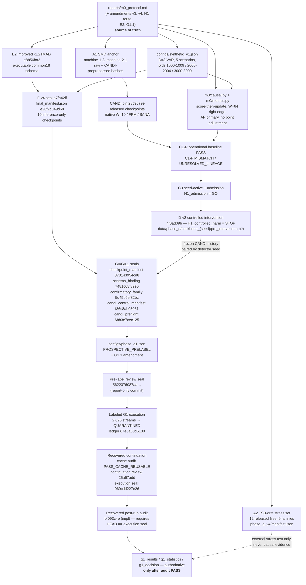

# Protocol and artifact provenance map

Purpose: let a new researcher answer two questions without reading the whole repository.

1. **Which artifact determines what?** — i.e. if this file changed, which scientific quantity would
   change with it.
2. **Which scientific choices were made before outcome access?** — i.e. which numbers in a future
   paper were fixed by a commit that could not have seen the result it governs.

Hash prefixes below are the first 12 hex characters; full values live in the named JSON. Commit SHAs
are given in the form the repository uses them (full where they act as a seal argument).

---

## 1. The chain of authority



Read the solid edges as "determines"; the dotted edge is the one deliberate non-dependency — A2
results may appear in a paper as descriptive stress evidence but may not enter H2/H3/H4a inference.

---

## 2. Which artifact determines what

### Data identity

| Artifact | Determines | Notes |
|---|---|---|
| `reports/phase_a/smd_seal.json`, `phase_a_v3` re-verification | The strict A1 anchor: exactly `machine-1-8` and `machine-2-1`, raw + CANDI-preprocessed byte hashes | The only real-data route for natural admission and any future natural-SMD harm audit |
| `reports/phase_a_v4/manifest.json` + `selection_summary.json` | The twelve A2 files, their buckets, source families and the provenance denominators (75 / 37 / 60 / 23 / 12 / 9) | Source families, not files, are the inference unit; `native_provenance_unresolved` is never read as independence |
| `reports/phase_a/candidate_inventory.json`, `source_groups.json`, `downloads.json` | Reproducibility of the selection: every candidate, exclusion reason, hash, duplicate group and download URL | Includes the rejected provisional v3 list, kept visible on purpose |
| `configs/synthetic_v1.json` | The entire controlled stream: VAR coefficients, five scenarios, event schedules, severities {1,2,3}, durations {1,16,64,256}, clean fit/calibration prefix, and the source-disjoint folds | Generator seeds never cross folds: train 1000–1009, validation 2000–2004, test 3000–3009 |

### Measurement contract

| Artifact | Determines |
|---|---|
| `m0/causal.py` | Score-before-update ordering, immutable decision records, W=64/stride 1 right-edge decisions, fit-only scaler, calibration-percentile threshold, and the separate candidate / queue-admitted / committed / optimizer-exposure denominators |
| `m0/metrics.py` | AP as the primary metric, trapezoidal PR-AUC as a separately named CANDI-reproduction metric, AUROC with tied scores grouped, fixed-threshold FPR/recall, censored post-shift recovery, and N/A semantics for zero denominators |
| `m0/correlation.py` | The correlation-only regime pair and its analytic verification (target stationary covariance, discrete-Lyapunov residual, matched marginals) |
| `reports/m0_protocol.md` §"Decision rules frozen before outcomes" | Every GO threshold, the 0.02 practical margin, bootstrap draws 10,000 with seed 901, sign-flip seed 902, Holm α=0.05, and the reproducibility counts (≥4/5 seeds, ≥3/4 shifted scenarios) |

### Models

| Artifact | Determines |
|---|---|
| CANDI pin `28c9679e5038…` + released checkpoints | The operational adaptation baseline: native preprocessing, W=10, FPM, SANA, `TRAIN.ENABLE=False`, and the preserved native bookkeeping defects |
| `reports/phase_c_v2/amendment.md` | The split between C1-P (paper fidelity) and C1-R (released-artifact operational fidelity) and the three ordered C1-R gates |
| xLSTMAD pin `e8b56ba27352…` (+ `xlstm==2.0.5`, `lightning==2.6.1`, vanilla float32) | The valid xLSTM track: D=8, W=64, embedding 40, 73,504 parameters, fresh per-window reset |
| xLSTMAD v1 evidence (`reports/phase_e/`) | Immutable record that the submission version is invalid for this use (`[W,B,D]` vs `[B,W,D]` flattening; repeated tail windows) — not a repairable dependency |
| `reports/phase_f_v4/final_manifest.json` (`e20f2d349d68…`, F-v4 seal commit `a7fa42ff2c0c…`) | The ten eligible checkpoints and their hashes; `lstm_11`/`lstm_22` carried by reference from F3 |
| `reports/phase_g/checkpoint_manifest.json` (`370143954cd8…`) | Which of those checkpoints Phase G may load, plus `forbidden_paths` (F-v1/F-v2/F-v3 partials, F3-R diagnostics, `final.pt` when it differs from `best.pt`) and the inference-only model policy |

### Features, probe and hypotheses

| Artifact | Determines |
|---|---|
| `reports/phase_g/schema_binding.json` (`7481c68f89e0…`) | The executable column schema: history 14, internal base 18, hidden 52, gate 130, memory 52, combined 234, history+combined 248; rolling widths 4/8/16/32; xLSTM restricted to its four scalar sLSTM cells; LSTM pooling all six recurrent layers equally; mLSTM-only features excluded from confirmatory use |
| `reports/phase_g/confirmatory_family.json` (`5d45b6ef82bc…`) | The four Holm members and their estimands (H2, H3a-A, H3a-B, H3a-C), the conditionality of H3a on H2, and the list of families that are descriptive only |
| `reports/phase_g/candi_control_manifest.json` (`f86c8ab05061…`) + `candi_preflight.json` (`6bb3e7cec125…`) | The H3a-C shared history control: `data/phase_d/backbone_{11,22,33,44,55}/pre_intervention.pth`, CANDI at native W=10, right-edge alignment with the common stream starting at t=63, byte-identical row keys reused across both backbone arms |
| `configs/phase_g1.json` + `reports/phase_g1/g1_1_duration_severity_amendment.md` | The probe (L2 logistic, StandardScaler on train, C ∈ {0.01,0.1,1,10} by validation AP, purge 96), the primary label boundary (anomaly windows positive; anomaly-free drift/transition windows negative; mixed windows a separate stress stratum), the duration/severity robustness estimand and its macro gates, and the semantic non-identifiability control |
| `reports/h1_status.json` + `reports/h1_route_amendment.md` | The route-qualified H1 status that downstream text must quote verbatim: admission GO, controlled harm STOP, natural harm NOT_RUN, overall UNRESOLVED, H4a/H4b LOCKED |

### Execution integrity (Phase G1)

| Artifact | Determines |
|---|---|
| `reports/phase_g1/g1_self_review_prelabel_v2.json` | The pre-label `PASS_FOR_LABEL_ACCESS` review; its byte-identity is what makes seal `5622376087aa…` meaningful |
| `reports/phase_g1/g1_postlabel_failure_v1.{md,json}` | The incident record: 2,625 completed stream extractions, terminal `process_exception`, quarantined ledger `67e6a30d5180…`, and the `QUARANTINED / STOP_RESULT_UNRESOLVED` status of everything that run produced |
| `reports/phase_g1/g1_reporting_patch_v1.{md,json}` + `g1_reporting_patch_audit_v1.json` | Exactly which seven files changed between the pre-label seal and the reporting patch `2c79cbf62574…`, and the requirement that the only scientific-path change is `output_dir` canonicalization |
| `reports/phase_g1/g1_cache_audit_v1.json` (+ `g1_cache_file_inventory_v1.jsonl.gz`) | `PASS_CACHE_REUSABLE` and its evidence: 120,000 files as 40,000 NPZ triplets, 2,500 shifted primary streams, 2,625 labelled-stream completions, 48 stream/backbone replay pairs, 384 feature-arm comparisons |
| `reports/phase_g1/g1_continuation_self_review_v2.{md,json}` | The continuation gate bound to reviewed implementation `25a67addabf2…` and the exact byte hashes of its four reviewed executables |
| `reports/phase_g1/g1_r2_self_review.{md,json}` + `g1_r2_metric_free_provenance.{md,json}` | The recovered post-run auditor (`bf093c4ebafe…`, report seal `069cdd227e26…`), its lineage checks, and the metric-free statement that no cache array, label, probe fit or AP was read at that boundary |

---

## 3. Which choices were fixed before outcome access

Ordered as the project made them. "Blind" below means the commit could not have seen the result it
governs, because the corresponding data or labels had not been read at that point.

| # | Choice | Fixed by | Blind to |
|---|---|---|---|
| 1 | Datasets, eligibility rule, buckets, selection objectives | `m0_protocol.md` + A-v3/A-v4 amendments (committed before manifest generation) | All detector results |
| 2 | Generator equations, scenarios, event schedules, severity/duration grids, fold assignment | `configs/synthetic_v1.json` + `m0/correlation.py` tests committed before any observation was inspected | All model output |
| 3 | Causal contract and metric semantics (score-then-update, AP primary, no point adjustment, N/A rules) | `m0/causal.py`, `m0/metrics.py` (Phase B, before any detector) | All detector results |
| 4 | CANDI reproduction tolerance (0.02) and the paper-vs-release fidelity split | `m0_protocol.md`; `phase_c_v2/amendment.md` (pre-execution) | The second machine's outcome |
| 5 | H1 intervention design: contamination grid, pairing, official operator, c=30 as stress-only | Phase-D prospective (`9018e86`), sealed before the first harm arm | All harm results |
| 6 | Matched-LSTM geometry (three+three layers, H=38, 71,790 params) and the shared training contract | Phase-F prospective + `configs/phase_f*.json`, before any optimizer step | Any probe or AP result |
| 7 | Raw-output partition reclassified diagnostic-only | F-v4 prospective, committed before the first F-v4 optimizer step, symmetric across both models | All F-v4 training outcomes |
| 8 | Which checkpoints exist and which are forbidden | `phase_g/checkpoint_manifest.json` (G0, label-blind) | All labeled results |
| 9 | Feature schema and pooling rules | `phase_g/schema_binding.json` (G0, label-blind) | All labeled results |
| 10 | The four-member Holm family, its estimands and H3a's conditionality | `phase_g/confirmatory_family.json` (G0, label-blind) | All labeled results |
| 11 | The CANDI history control artifact, seed pairing and W=10↔W=64 alignment | G0.1 amendment + alignment preflight (label-blind; earlier state recorded as `UNRESOLVED_PRELABEL` rather than chosen post hoc) | All labeled results |
| 12 | Probe family, C grid, selection metric, purge, label boundary | `configs/phase_g1.json` (PROSPECTIVE_PRELABEL) | All labeled results |
| 13 | Duration/severity robustness estimand and macro gates; semantic control's role | G1.1 amendment, written before any label, probe fit or AP | All labeled results |
| 14 | Bootstrap and permutation seeds (901 / 902), draws (10,000), resampling order (sources then detector seeds) | `m0_protocol.md` decision-rules section | All labeled results |
| 15 | That the run may not be reinterpreted after a post-label defect | The fail-closed rule in `m0_protocol.md`; exercised by the G1 incident record | The eventual outcome |

Items 1–14 are what makes the eventual G1 report a confirmatory test rather than an exploratory one.
Item 15 is what makes the quarantine credible: the rule existed before the failure it governed.

---

## 4. Seal grammar (how to read a G1 commit)

The project separates *implementation* commits from *review* commits, because a commit cannot embed
its own SHA:

```
implementation commit        fe507084b9a1…   code + config, NO passing self-review
        │
        ├── fresh adversarial review reads that exact tree
        │
report-only review commit    5622376087aa…   contains PASS_FOR_LABEL_ACCESS
        │
        └── launcher requires: --prelabel-seal <review commit>,
            reviewed implementation is an ancestor,
            every scientific file byte-identical across both commits and the working tree,
            explicit --label-access flag
```

The same grammar repeats for each recovery step: a reporting patch (`2c79cbf62574…`) with its own
scope audit, a cache-reuse guard re-review (`4977c6bdf9bd…`), a continuation implementation
(`25a67addabf2…`) with a report-only seal, and a recovered auditor implementation
(`bf093c4ebafe…`) whose report-only seal `069cdd227e26…` is also the continuation *execution* seal.

Two consequences worth knowing before touching the repository:

- **`HEAD` is load-bearing while a recovered continuation is live.** The recovered post-run auditor
  raises `ProtocolViolation` unless `git rev-parse HEAD` equals the continuation execution seal, and
  unless the execution manifest's `execution_commit` matches it. Committing anything on that
  checkout — even a README edit — blocks the audit until `HEAD` returns to the seal.
- **A passing self-review never lives in the same commit as the code it reviews.** If you find one
  that does, the seal grammar has been violated.

---

## 5. What is *not* determined by any artifact here

- **Natural-SMD causal harm.** No artifact contains it; `h1_status.json` says `NOT_RUN`, and the
  controlled STOP may not be generalized to it.
- **Real-data drift-versus-anomaly truth.** The protocol declares it unavailable without independent
  annotation, so every H2/H3a statement is synthetic-only by construction.
- **Deployment behaviour.** No phase has run an adaptation mechanism with delay, rollback or dual
  memory; those remain locked, and nothing in `reports/` licenses a claim about them.
