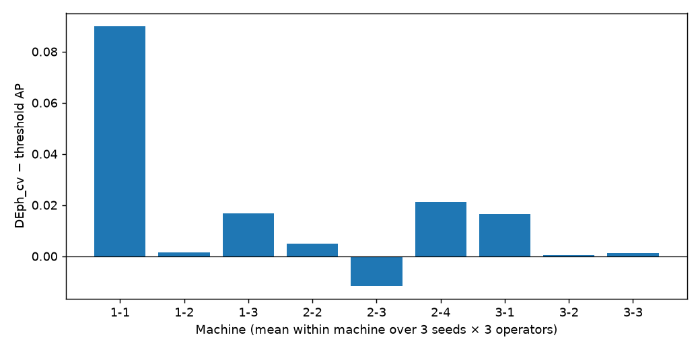
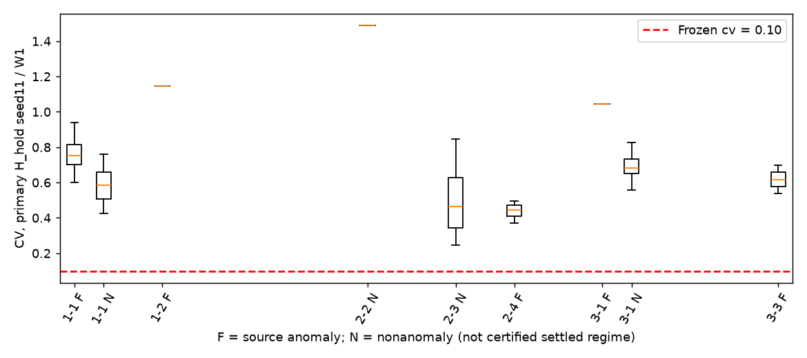

# Step 2c — Frozen Stabilisation Transfer Test

**PARTIAL_TRANSFER — pending review.**

Promotion-specific fault rejection transfers in this exploratory set: 0/165 H_hold fault checkpoints pass frozen 0.10, and 0/21 actual DEph_cv promotions touch source anomaly. AP gains are positive in 8/9 machines and remain positive after excluding the largest-gain machine, but much of the threshold comparison comes from segment admission rather than CV promotion. Primary direction is comparable on only 2/9 machines (both consistent); all-operator robustness reverses on machine-2-2. Frozen 0.10 passes 0/111 primary nonanomaly checkpoints, with limited operator-specific promotions elsewhere. No legitimate benign-regime ground truth exists, so new-normal adaptation is NOT EVALUABLE. Low recall and substantial below-threshold fault writing prevent a general memory-safety claim. This is PARTIAL_TRANSFER, not a method PASS or authorization for Step3.

## 1. Exposure, source and scope

[Step 2c-A audit](STEP2C_DATA_AUDIT.md) and [frozen protocol](PROTOCOL.md) provide the evidence index and candidate decisions. All 28 SMD labels were historically parsed, including the nine selected here. None of these nine participated in Step 2a/2b feature/rule development. This is **frozen exploratory machine-transfer**, not strict confirmatory. Priority A was not established; HAI 22.04 Git LFS unavailable and SWaT original restricted acquisition are BLOCKED. No fallback sources. Strict confirmatory validation remains unavailable.

Official [OmniAnomaly raw source](https://github.com/NetManAIOps/OmniAnomaly/tree/7fb0e0acf89ea49908896bcc9f9e80fcfff6baf4/ServerMachineDataset) pinned at `7fb0e0acf89ea49908896bcc9f9e80fcfff6baf4`. Raw observation hashes/shapes/constant channels/URLs: [dataset_manifest.json](run/dataset_manifest.json). Full train/test files, no crop, source row/channel order retained, timestamps absent. Binary labels identify anomalies, not equipment fault type or legitimate operating-mode transitions. Source normal train assumption is not independently train-label verified.

## 2. Frozen policy and detector

`DEph_cv = self <= 1.0 AND stat <= 0.5 AND cv <= 0.10`. Rule was generated post-hoc on Step 2b development data; **this transfer run has posthoc=false**, no test-driven changes. Seven candidate policies plus H_hold diagnostic; [policy_config.json](run/policy_config.json). Window8, dk128 random ReLU, seeds11/22/33; W1 kNN5, W2 f=.995, W3 beta=.1. Same38 dimensions, no representation adaptation. Train-only scaling/clipping; M0 first80% of train, tau q.99 on final20%. Calibration remains part of the source train used for scaler as in Step 2b; test statistics never fit scaler/tau. Block16 score-before-write; age256 checkpoints every128; trail256 only for DE/trailing PROMOTE. Fixed512 whole-buffer D_quarantine baseline unchanged. Executable segment DISCARD uses gap>2 (third clean block); earlier prose mismatch disclosed before labels. No tuning/rescue/classifier/RL, no point-adjust.

## 3. Label access chronology and integrity

- Protocol/code/audit commit: `421c7c66a022302c8ff1ac359f87a89bd70cf20a` (pushed before full run).
- Seal SHA256: `fb413d66f7755a0d012a7f0bdccb95d16d50652fb089d5b5495c4d8ac084a78b`.
- Seal commit: `37e7f32dd42e3b895e3cb622f2ea835ea7cdafd6`; remote verified `37e7f32dd42e3b895e3cb622f2ea835ea7cdafd6` before each access.
- Seal UTC: `2026-10-04T05:13:45Z`, labels_read=0, cv_max=.10, posthoc=false.
- First label parsing attempt UTC: `2026-10-04T05:15:18Z`; last `2026-10-04T05:15:52Z`; **9** vectors, one per machine.
- Full code/config/trace hashes checked, then committed seal bytes and remote ancestry checked by the label loader. Logs are self-reported execution evidence, not an OS-wide proof of historic nonaccess.

[seal.json](run/seal.json), [label_access_log.json](results/label_access_log.json), [environment.json](run/environment.json). Raw labels remain ignored. Label-free smoke: 24 traces/seed11/machine1-1; all 23 prelabel tests passed. Complete run: 648 score trajectories, 3090 evidence checkpoints, 9 machines × 3 seeds × 3 operators; seeds/operators/checkpoints are **not independent N**. Independent physical entity unit available is machine, N=9; cross-machine source dependencies unknown.

## 4. Machine results and gain concentration (Q5)

Each cell below averages the 9 seed/operator trajectories **within that machine**. Operator-specific and every candidate-policy table are retained separately.

| machine | AP | VUS_PR | normal_FPR | point_recall | anomaly_written_frac | delta_AP | delta_VUS_PR |
| --- | --- | --- | --- | --- | --- | --- | --- |
| machine-1-1 | 0.4869 | 0.5034 | 0.0666 | 0.4433 | 0.0996 | 0.0900 | 0.0914 |
| machine-1-2 | 0.2188 | 0.2634 | 0.0057 | 0.2048 | 0.2591 | 0.0015 | 0.0015 |
| machine-1-3 | 0.2700 | 0.3355 | 0.0098 | 0.0792 | 0.8341 | 0.0169 | 0.0312 |
| machine-2-2 | 0.1576 | 0.1953 | 0.0138 | 0.0362 | 0.5324 | 0.0050 | 0.0059 |
| machine-2-3 | 0.4888 | 0.4790 | 0.0327 | 0.7129 | 0.0058 | -0.0116 | -0.0121 |
| machine-2-4 | 0.4821 | 0.5295 | 0.0016 | 0.2388 | 0.4543 | 0.0212 | 0.0235 |
| machine-3-1 | 0.5022 | 0.4132 | 0.0744 | 0.6962 | 0.0000 | 0.0165 | 0.0185 |
| machine-3-2 | 0.0581 | 0.0665 | 0.0035 | 0.0146 | 0.8234 | 0.0004 | 0.0008 |
| machine-3-3 | 0.1728 | 0.2204 | 0.0038 | 0.0723 | 0.5257 | 0.0013 | 0.0026 |

All primary comparisons (DEph_cv minus baseline):

| machine | baseline | delta_AP | delta_VUS_PR |
| --- | --- | --- | --- |
| machine-1-1 | C_threshold | 0.0900 | 0.0914 |
| machine-1-1 | D_quarantine | 0.0563 | 0.0546 |
| machine-1-1 | D_trail512 | 0.0771 | 0.0771 |
| machine-1-1 | DE_stab | 0.0234 | 0.0230 |
| machine-1-1 | A_no_update | 0.0049 | 0.0092 |
| machine-1-2 | C_threshold | 0.0015 | 0.0015 |
| machine-1-2 | D_quarantine | 0.0015 | 0.0015 |
| machine-1-2 | D_trail512 | 0.0000 | 0.0000 |
| machine-1-2 | DE_stab | 0.0000 | 0.0000 |
| machine-1-2 | A_no_update | 0.0011 | -0.0024 |
| machine-1-3 | C_threshold | 0.0169 | 0.0312 |
| machine-1-3 | D_quarantine | 0.0021 | 0.0068 |
| machine-1-3 | D_trail512 | 0.0122 | 0.0206 |
| machine-1-3 | DE_stab | 0.0000 | 0.0000 |
| machine-1-3 | A_no_update | 0.0928 | 0.1460 |
| machine-2-2 | C_threshold | 0.0050 | 0.0059 |
| machine-2-2 | D_quarantine | 0.0050 | 0.0059 |
| machine-2-2 | D_trail512 | 0.0000 | 0.0000 |
| machine-2-2 | DE_stab | -0.0015 | -0.0013 |
| machine-2-2 | A_no_update | -0.0307 | -0.0341 |
| machine-2-3 | C_threshold | -0.0116 | -0.0121 |
| machine-2-3 | D_quarantine | -0.0116 | -0.0121 |
| machine-2-3 | D_trail512 | -0.0042 | -0.0037 |
| machine-2-3 | DE_stab | -0.0057 | -0.0049 |
| machine-2-3 | A_no_update | 0.0160 | 0.0159 |
| machine-2-4 | C_threshold | 0.0212 | 0.0235 |
| machine-2-4 | D_quarantine | 0.0212 | 0.0235 |
| machine-2-4 | D_trail512 | 0.0000 | 0.0000 |
| machine-2-4 | DE_stab | 0.0008 | 0.0007 |
| machine-2-4 | A_no_update | 0.1463 | 0.1707 |
| machine-3-1 | C_threshold | 0.0165 | 0.0185 |
| machine-3-1 | D_quarantine | 0.0165 | 0.0185 |
| machine-3-1 | D_trail512 | 0.0094 | 0.0139 |
| machine-3-1 | DE_stab | -0.0072 | -0.0070 |
| machine-3-1 | A_no_update | 0.0251 | 0.0310 |
| machine-3-2 | C_threshold | 0.0004 | 0.0008 |
| machine-3-2 | D_quarantine | 0.0004 | 0.0008 |
| machine-3-2 | D_trail512 | 0.0000 | 0.0000 |
| machine-3-2 | DE_stab | 0.0000 | 0.0000 |
| machine-3-2 | A_no_update | -0.0026 | -0.0041 |
| machine-3-3 | C_threshold | 0.0013 | 0.0026 |
| machine-3-3 | D_quarantine | 0.0013 | 0.0026 |
| machine-3-3 | D_trail512 | 0.0000 | 0.0000 |
| machine-3-3 | DE_stab | 0.0007 | 0.0007 |
| machine-3-3 | A_no_update | 0.0793 | 0.1164 |

Operator robustness (descriptive trajectory means, not extra independent machines):

| op | AP | VUS_PR | normal_FPR | point_recall | anomaly_written_frac | fault_promotions | majority_fault_promotions |
| --- | --- | --- | --- | --- | --- | --- | --- |
| W1 | 0.3149 | 0.3371 | 0.0189 | 0.2737 | 0.3150 | 0.0000 | 0.0000 |
| W2_f0995 | 0.3011 | 0.3141 | 0.0308 | 0.2712 | 0.4491 | 0.0000 | 0.0000 |
| W3_b01 | 0.3298 | 0.3509 | 0.0210 | 0.2879 | 0.4140 | 0.0000 | 0.0000 |

Against threshold, positive machine ΔAP: 8/9; negative: 1/9. Macro machine ΔAP=0.0157; ΔVUS-PR=0.0181. Remove each machine in turn: ΔAP mean range [0.0064, 0.0191]. Positive-gain machines and every negative machine remain listed; no success gate based on pooled mean.

A promotion-specific comparison with the predeclared H_hold diagnostic separates segment admission semantics from CV-enabled promotion: DEph_cv−H_hold AP is machine-1-1: 0.0061, machine-1-2: 0.0000, machine-1-3: 0.0265, machine-2-2: 0.0000, machine-2-3: 0.0000, machine-2-4: 0.0000, machine-3-1: 0.0248, machine-3-2: 0.0000, machine-3-3: 0.0000. Six machines have identical DEph_cv/H_hold scores and no DEph_cv promotion; their threshold comparison gains cannot be attributed to stabilisation promotion. This diagnostic does not introduce a new policy.

## 5. CV direction (Q1)

Primary reference is H_hold seed11/W1: each physical persistent segment comes from sealed label-free boundaries. Fault checkpoint = trailing256 anomaly fraction>=.5, nonanomaly =0, mixed separate. **Nonanomaly is not certified benign/settled normal.**

| machine | scope | n_fault | n_nonanomaly | fault_cv_median | nonanomaly_cv_median | direction | cv_AUROC |
| --- | --- | --- | --- | --- | --- | --- | --- |
| machine-1-1 | primary_seed11_W1 | 14 | 7 | 0.7526 | 0.5842 | consistent | 0.8673 |
| machine-1-2 | primary_seed11_W1 | 1 | 0 | 1.1441 | N/A | unresolved | N/A |
| machine-1-3 | primary_seed11_W1 | 0 | 0 | N/A | N/A | no checkpoints | N/A |
| machine-2-2 | primary_seed11_W1 | 0 | 1 | N/A | 1.4874 | unresolved | N/A |
| machine-2-3 | primary_seed11_W1 | 0 | 80 | N/A | 0.4624 | unresolved | N/A |
| machine-2-4 | primary_seed11_W1 | 3 | 0 | 0.4453 | N/A | unresolved | N/A |
| machine-3-1 | primary_seed11_W1 | 1 | 23 | 1.0452 | 0.6840 | consistent | 1.0000 |
| machine-3-2 | primary_seed11_W1 | 0 | 0 | N/A | N/A | no checkpoints | N/A |
| machine-3-3 | primary_seed11_W1 | 2 | 0 | 0.6175 | N/A | unresolved | N/A |

All-seed/operator robustness direction, with reversals explicit (not additional independent N):

| scope | machine | n_fault | n_nonanomaly | fault_cv_median | nonanomaly_cv_median | direction | cv_AUROC |
| --- | --- | --- | --- | --- | --- | --- | --- |
| robustness_all | machine-1-1 | 121 | 82 | 0.5316 | 0.3148 | consistent | 0.8352 |
| robustness_all | machine-1-2 | 2 | 0 | 1.1632 | N/A | unresolved | N/A |
| robustness_all | machine-1-3 | 0 | 18 | N/A | 0.0024 | unresolved | N/A |
| robustness_all | machine-2-2 | 11 | 3 | 0.6770 | 0.8515 | REVERSED | 0.4848 |
| robustness_all | machine-2-3 | 0 | 249 | N/A | 0.4594 | unresolved | N/A |
| robustness_all | machine-2-4 | 19 | 0 | 0.4149 | N/A | unresolved | N/A |
| robustness_all | machine-3-1 | 6 | 243 | 1.0339 | 0.5229 | consistent | 1.0000 |
| robustness_all | machine-3-3 | 6 | 0 | 0.6239 | N/A | unresolved | N/A |

Reversed machines in this robustness summary: machine-2-2. A machine with only one class cannot establish direction. Primary paired-class support: 2/9.

Every primary physical reference segment (not checkpoint-independent evidence):

| machine | start | last_checkpoint | n_checkpoints | n_fault | n_nonanomaly | fault_cv_median | nonanomaly_cv_median | n_pass_cv_fault | n_pass_conjunction_fault |
| --- | --- | --- | --- | --- | --- | --- | --- | --- | --- |
| machine-1-1 | 12240 | 12496 | 1 | 0 | 1 | N/A | 0.4256 | 0 | 0 |
| machine-1-1 | 13648 | 14032 | 2 | 0 | 2 | N/A | 0.5877 | 0 | 0 |
| machine-1-1 | 15088 | 15344 | 1 | 0 | 1 | N/A | 0.7606 | 0 | 0 |
| machine-1-1 | 15840 | 16096 | 1 | 1 | 0 | 0.9261 | N/A | 0 | 0 |
| machine-1-1 | 16192 | 16576 | 2 | 1 | 0 | 0.6853 | N/A | 0 | 0 |
| machine-1-1 | 16944 | 17712 | 5 | 4 | 0 | 0.8154 | N/A | 0 | 0 |
| machine-1-1 | 18064 | 18576 | 3 | 3 | 0 | 0.7027 | N/A | 0 | 0 |
| machine-1-1 | 19360 | 19744 | 2 | 2 | 0 | 0.7861 | N/A | 0 | 0 |
| machine-1-1 | 19856 | 20112 | 1 | 1 | 0 | 0.6024 | N/A | 0 | 0 |
| machine-1-1 | 20784 | 21168 | 2 | 2 | 0 | 0.7774 | N/A | 0 | 0 |
| machine-1-1 | 22208 | 22464 | 1 | 0 | 1 | N/A | 0.5325 | 0 | 0 |
| machine-1-1 | 24672 | 25056 | 2 | 0 | 1 | N/A | 0.6257 | 0 | 0 |
| machine-1-1 | 26096 | 26480 | 2 | 0 | 1 | N/A | 0.5842 | 0 | 0 |
| machine-1-2 | 5728 | 5984 | 1 | 0 | 0 | N/A | N/A | 0 | 0 |
| machine-1-2 | 18544 | 18800 | 1 | 1 | 0 | 1.1441 | N/A | 0 | 0 |
| machine-2-2 | 11648 | 11904 | 1 | 0 | 1 | N/A | 1.4874 | 0 | 0 |
| machine-2-3 | 2976 | 8352 | 41 | 0 | 34 | N/A | 0.6126 | 0 | 0 |
| machine-2-3 | 14656 | 21696 | 54 | 0 | 46 | N/A | 0.3496 | 0 | 0 |
| machine-2-4 | 18032 | 18288 | 1 | 1 | 0 | 0.4453 | N/A | 0 | 0 |
| machine-2-4 | 18592 | 18976 | 2 | 2 | 0 | 0.4342 | N/A | 0 | 0 |
| machine-3-1 | 5312 | 5696 | 2 | 1 | 0 | 1.0452 | N/A | 0 | 0 |
| machine-3-1 | 11216 | 11472 | 1 | 0 | 1 | N/A | 0.9229 | 0 | 0 |
| machine-3-1 | 15104 | 15616 | 3 | 0 | 3 | N/A | 0.7024 | 0 | 0 |
| machine-3-1 | 16416 | 16672 | 1 | 0 | 1 | N/A | 0.7307 | 0 | 0 |
| machine-3-1 | 16880 | 17136 | 1 | 0 | 1 | N/A | 0.7357 | 0 | 0 |
| machine-3-1 | 17184 | 17440 | 1 | 0 | 1 | N/A | 0.6515 | 0 | 0 |
| machine-3-1 | 18016 | 18272 | 1 | 0 | 1 | N/A | 0.7630 | 0 | 0 |
| machine-3-1 | 18752 | 19008 | 1 | 0 | 1 | N/A | 0.5909 | 0 | 0 |
| machine-3-1 | 20128 | 20384 | 1 | 0 | 1 | N/A | 0.5168 | 0 | 0 |
| machine-3-1 | 21024 | 21280 | 1 | 0 | 1 | N/A | 0.8247 | 0 | 0 |
| machine-3-1 | 21376 | 21632 | 1 | 0 | 1 | N/A | 0.6886 | 0 | 0 |
| machine-3-1 | 21888 | 22144 | 1 | 0 | 1 | N/A | 0.6358 | 0 | 0 |
| machine-3-1 | 22608 | 22864 | 1 | 0 | 1 | N/A | 0.6478 | 0 | 0 |
| machine-3-1 | 23264 | 23520 | 1 | 0 | 1 | N/A | 0.6245 | 0 | 0 |
| machine-3-1 | 25520 | 25776 | 1 | 0 | 1 | N/A | 0.6517 | 0 | 0 |
| machine-3-1 | 26896 | 27408 | 3 | 0 | 3 | N/A | 0.6785 | 0 | 0 |
| machine-3-1 | 27728 | 28624 | 6 | 0 | 4 | N/A | 0.6884 | 0 | 0 |
| machine-3-3 | 19456 | 19840 | 2 | 2 | 0 | 0.6175 | N/A | 0 | 0 |

All-seed/operator medians and first/trajectory identities: [cv_direction.csv](results/cv_direction.csv), [physical_segments.csv](results/physical_segments.csv). Boundaries can differ across operators/seeds; those rows are robustness, not new physical entities.

## 6. Frozen 0.10 pass rates and promotions (Q2)

CV-only and full self/stat/CV conjunction rates below use primary H_hold checkpoints. Fault/nonanomaly/mixed strata retained; no threshold search.

| machine | cls | n_checkpoints | pass_cv | pass_conjunction | cv_median | cv_q10 | cv_q90 |
| --- | --- | --- | --- | --- | --- | --- | --- |
| machine-1-1 | fault | 14 | 0.0000 | 0.0000 | 0.7526 | 0.6826 | 0.9159 |
| machine-1-1 | mixed | 4 | 0.0000 | 0.0000 | 0.9308 | 0.8446 | 1.3590 |
| machine-1-1 | nonanomaly | 7 | 0.0000 | 0.0000 | 0.5842 | 0.4585 | 0.7212 |
| machine-1-2 | fault | 1 | 0.0000 | 0.0000 | 1.1441 | 1.1441 | 1.1441 |
| machine-1-2 | mixed | 1 | 0.0000 | 0.0000 | 1.1041 | 1.1041 | 1.1041 |
| machine-2-2 | nonanomaly | 1 | 0.0000 | 0.0000 | 1.4874 | 1.4874 | 1.4874 |
| machine-2-3 | mixed | 15 | 0.0000 | 0.0000 | 0.8933 | 0.6377 | 1.6571 |
| machine-2-3 | nonanomaly | 80 | 0.0000 | 0.0000 | 0.4624 | 0.2678 | 0.7915 |
| machine-2-4 | fault | 3 | 0.0000 | 0.0000 | 0.4453 | 0.3868 | 0.4860 |
| machine-3-1 | fault | 1 | 0.0000 | 0.0000 | 1.0452 | 1.0452 | 1.0452 |
| machine-3-1 | mixed | 3 | 0.0000 | 0.0000 | 0.9300 | 0.8677 | 0.9380 |
| machine-3-1 | nonanomaly | 23 | 0.0000 | 0.0000 | 0.6840 | 0.5976 | 0.7921 |
| machine-3-3 | fault | 2 | 0.0000 | 0.0000 | 0.6175 | 0.5530 | 0.6820 |

Actual promotion events summed over replicate trajectories, **not independent cases**. Any-fault means the promoted write contains >=1 labelled anomaly; majority-fault means >=50%. Nonanomaly promotion is not benign promotion. Full times/windows in [promotions.csv](results/promotions.csv).

| policy | promotion_trajectory_events | any_fault | majority_fault |
| --- | --- | --- | --- |
| DE_stab | 189 | 44 | 31 |
| DEph_cv | 21 | 0 | 0 |
| D_quarantine | 10 | 10 | 0 |
| D_trail512 | 113 | 29 | 17 |

## 7. Long-fault repeated opportunities (Q3)

Long fault = maximal source label1 episode >=256. The table lists **every** such episode for DEph_cv seed11/W1, including episodes with no checkpoint. H_hold counts show opportunities absent policy promotion/reset; actual DEph_cv checkpoint counts stop/reset when promoted. First pass time is exclusive source index t; `fraction_fault_written` includes both clean-threshold leakage and promoted fault points. Promotion touching any fault point is conservative. Full 3-seed/3-operator/all-policy table: [long_faults.csv](results/long_faults.csv).

| machine | episode | start | end | length | n_checkpoints | n_pass_cv | n_pass_conjunction | first_pass_time | was_promoted | fraction_fault_written | n_checkpoints_H_hold | n_pass_cv_H_hold |
| --- | --- | --- | --- | --- | --- | --- | --- | --- | --- | --- | --- | --- |
| machine-1-1 | 0 | 15849 | 16395 | 546 | 1 | 0 | 0 | N/A | False | 0.1172 | 1 | 0 |
| machine-1-1 | 1 | 16963 | 17517 | 554 | 3 | 0 | 0 | N/A | False | 0.0000 | 3 | 0 |
| machine-1-1 | 2 | 18071 | 18528 | 457 | 2 | 0 | 0 | N/A | False | 0.0000 | 2 | 0 |
| machine-1-1 | 3 | 19367 | 20088 | 721 | 2 | 0 | 0 | N/A | False | 0.1997 | 2 | 0 |
| machine-1-1 | 4 | 20786 | 21195 | 409 | 2 | 0 | 0 | N/A | False | 0.0000 | 2 | 0 |
| machine-2-2 | 2 | 15630 | 16502 | 872 | 0 | 0 | 0 | N/A | False | 0.4794 | 0 | 0 |
| machine-2-2 | 3 | 17090 | 17942 | 852 | 0 | 0 | 0 | N/A | False | 0.4883 | 0 | 0 |
| machine-2-2 | 4 | 18541 | 19382 | 841 | 0 | 0 | 0 | N/A | False | 0.5898 | 0 | 0 |
| machine-2-4 | 5 | 5099 | 5380 | 281 | 0 | 0 | 0 | N/A | False | 0.2598 | 0 | 0 |
| machine-2-4 | 15 | 17965 | 18350 | 385 | 1 | 0 | 0 | N/A | False | 0.2026 | 1 | 0 |
| machine-2-4 | 16 | 18579 | 18980 | 401 | 2 | 0 | 0 | N/A | False | 0.1222 | 2 | 0 |
| machine-2-4 | 17 | 19404 | 19741 | 337 | 0 | 0 | 0 | N/A | False | 0.7596 | 0 | 0 |
| machine-3-2 | 1 | 3080 | 3917 | 837 | 0 | 0 | 0 | N/A | False | 0.9235 | 0 | 0 |
| machine-3-3 | 21 | 19349 | 19830 | 481 | 1 | 0 | 0 | N/A | False | 0.2017 | 1 | 0 |

**Critical safety limitation:** zero fault promotion does not mean zero contamination or successful fault detection. DEph_cv macro point recall is 0.2776, anomaly-written fraction 0.3927. There are 14 physical long label1 episodes across 5 machines; long-fault written fractions reach 0.9618. Some long faults remain below tau and have no checkpoint, including machine-3-2; CV cannot reject points that bypass quarantine. Thus only **checkpoint promotion rejection**, not general contamination prevention, transfers here.

## 8. New-normal starvation (Q4)

**NOT EVALUABLE ON THIS DATASET.** New-normal promotion not identifiable from source labels. SMD has no approved benign-regime transition, no ground-truth settling time, and no independently annotated post-shift interval. Thus benign promotion count, post-shift FPR, adaptation time, promotion delay relative to real benign onset and post-promotion adaptation benefit are N/A. Generic persistent nonanomaly FPR is retained under that name only in metrics_units.csv; it cannot rescue the hypothesis. The PF-versus-new-regime figure is omitted.

## 9. Verdict and limitations

**PARTIAL_TRANSFER**. Promotion-specific fault rejection transfers in this exploratory set: 0/165 H_hold fault checkpoints pass frozen 0.10, and 0/21 actual DEph_cv promotions touch source anomaly. AP gains are positive in 8/9 machines and remain positive after excluding the largest-gain machine, but much of the threshold comparison comes from segment admission rather than CV promotion. Primary direction is comparable on only 2/9 machines (both consistent); all-operator robustness reverses on machine-2-2. Frozen 0.10 passes 0/111 primary nonanomaly checkpoints, with limited operator-specific promotions elsewhere. No legitimate benign-regime ground truth exists, so new-normal adaptation is NOT EVALUABLE. Low recall and substantial below-threshold fault writing prevent a general memory-safety claim. This is PARTIAL_TRANSFER, not a method PASS or authorization for Step3.

No numerical gate was invented. Sampling-rate dependence is **NOT EVALUABLE** because SMD source files have no timestamps and no verified point cadence. Descriptive checkpoint-age / operator dependence is retained in [cv_age_operator_diagnostic.csv](results/cv_age_operator_diagnostic.csv) and [cv_operator_diagnostic.csv](results/cv_operator_diagnostic.csv); the physical-segment table retains observed duration through the last checkpoint, not a supplied benign-regime duration. Final H_hold segment-duration dependence is in [cv_segment_length_diagnostic.csv](results/cv_segment_length_diagnostic.csv), reporting-only future endpoint information that is never a policy input. These diagnostics never change the frozen primary policy. This transfer does not establish semantic drift-vs-fault identifiability. Frozen .10 is evaluated as supplied; no revised threshold, checkpoint age, trailing window, representation, extra feature, oracle appendix or rescue. Historical label exposure prevents strict confirmation; repeated checkpoint windows are correlated; machine groups may share sources; one φ family / one detector setup, point-index cadence only. “Fault” in tables means source anomaly, not a verified causal equipment fault taxonomy. Effects cannot be extrapolated to HAI/SWaT; their secondary runs are BLOCKED.

Quarantine segment durations/censoring and promotion delays: [quarantine_segments.csv](results/quarantine_segments.csv). Memory trajectory: [memory_occupancy.csv.gz](results/memory_occupancy.csv.gz): W1 initial+test entries, W2/W3 retained test provenance ledger and separately fixed matrix/normalizer storage; entry count does not measure effective memory rank. Runs retain original operator end-size semantics. Full raw units, machine summaries, operator summaries and labelled checkpoints are reviewable under results/.

**Stop after Step 2c. Step3 / learned stopping / RL requires reviewer decision and is not executed. README status: pending review.**
